## Railways in UK

Hover over the image to find out the type of the train or which train station it is.

**Trains**

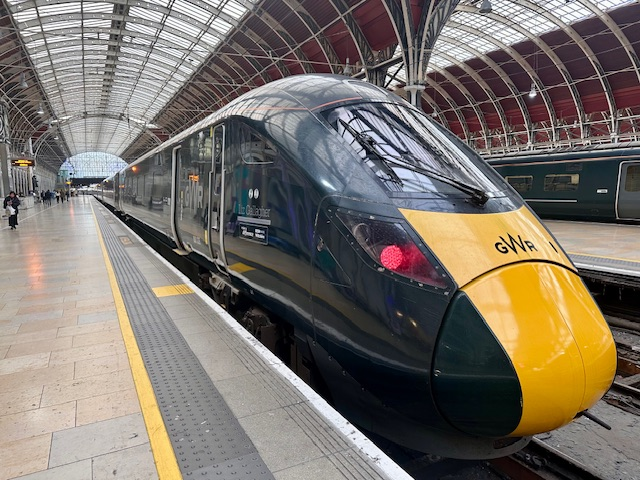

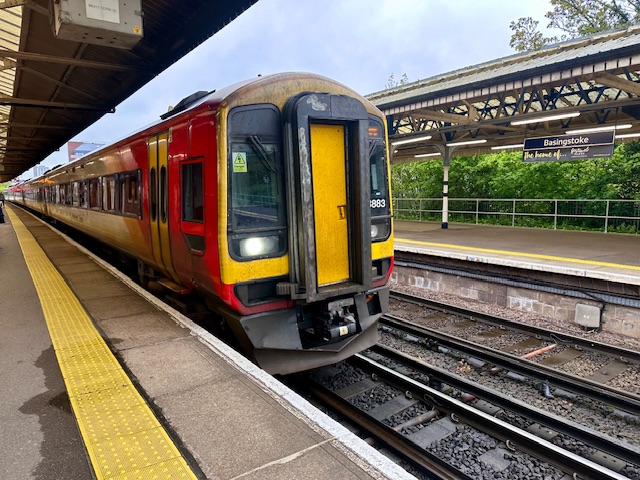

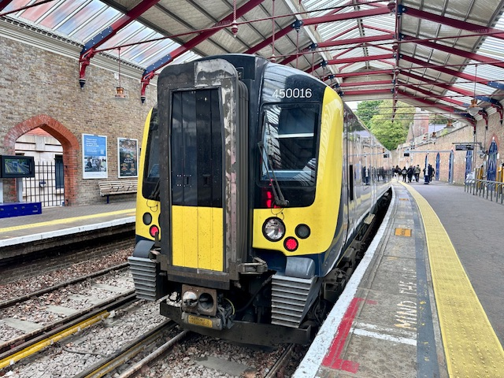

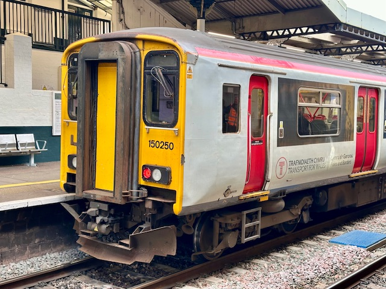
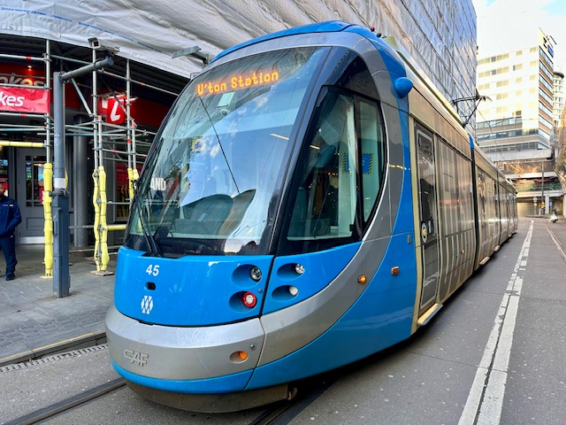
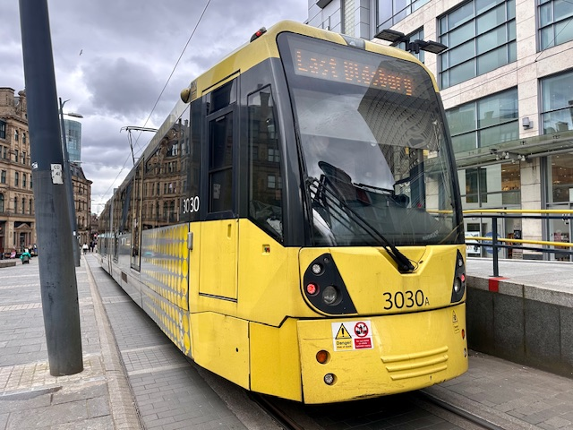

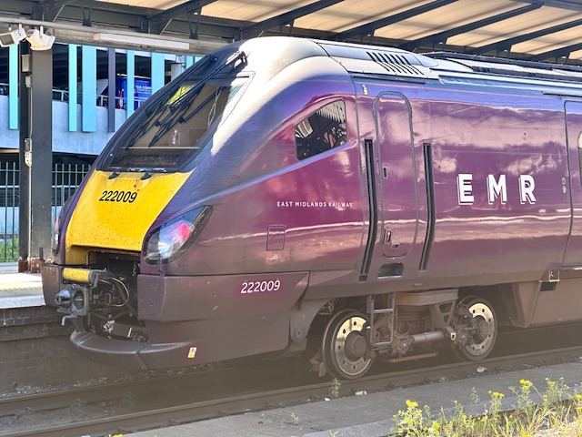
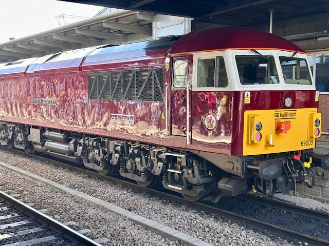
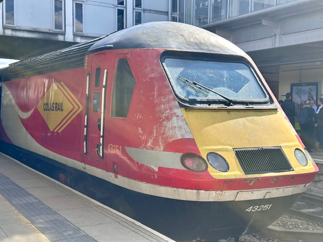
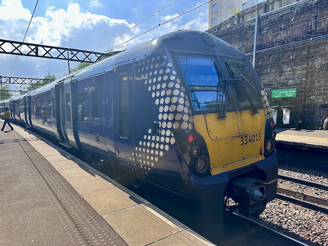

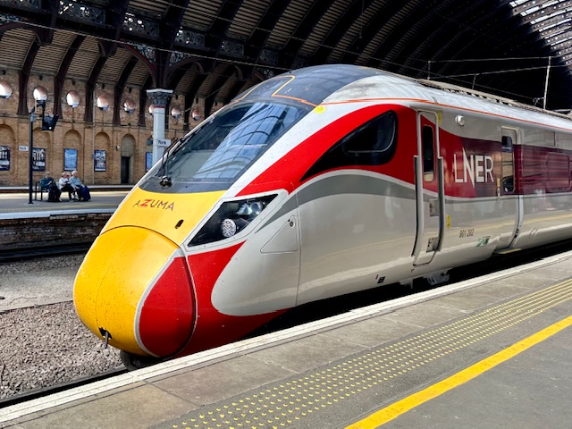

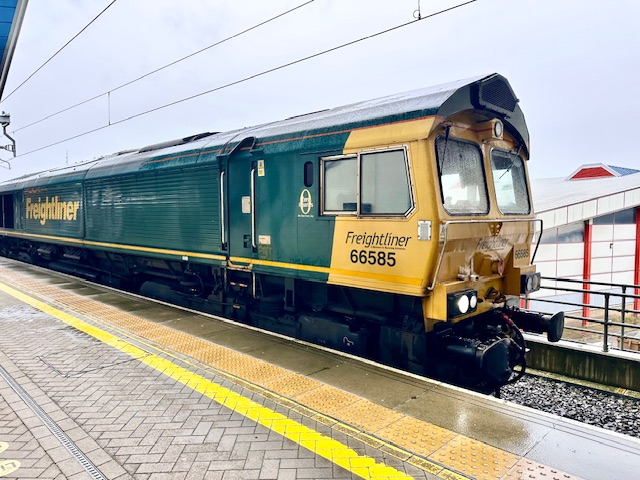

**Stations**

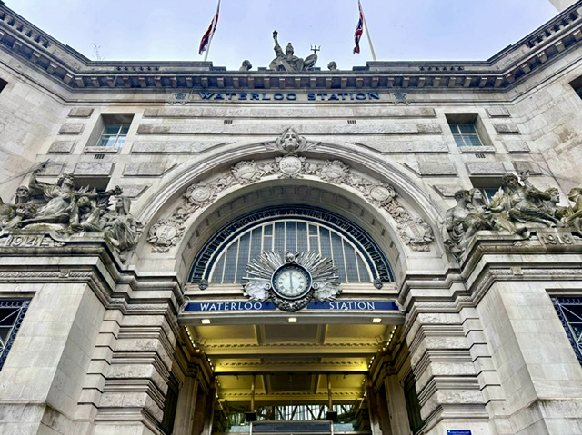
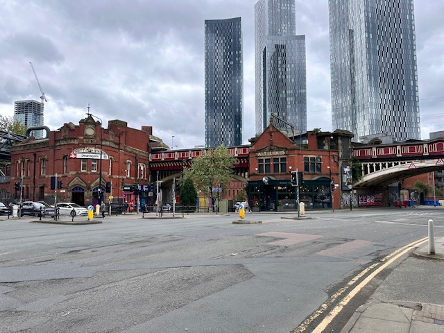

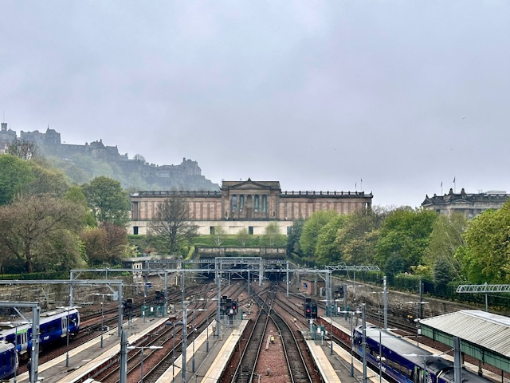
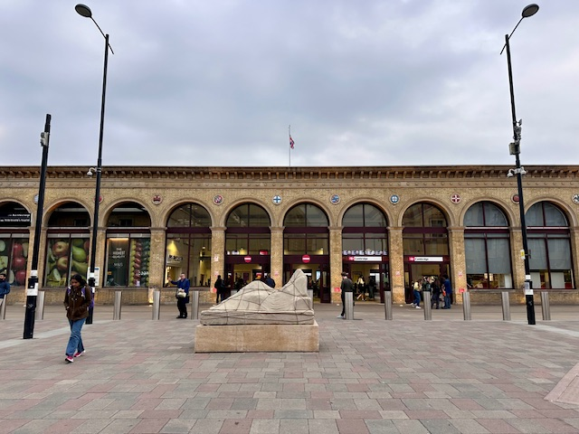
  
**Click [here](https://wqgcx.github.io/transport/20240426UK/) to go back.**
