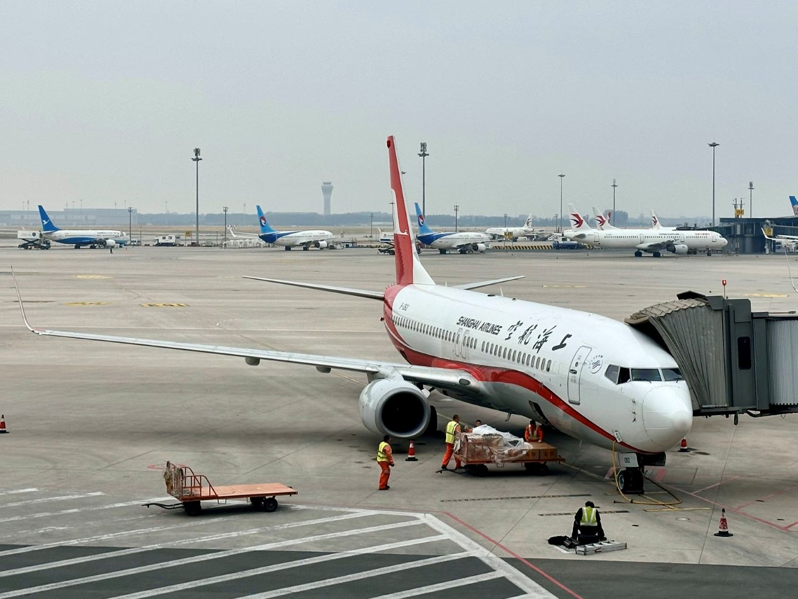
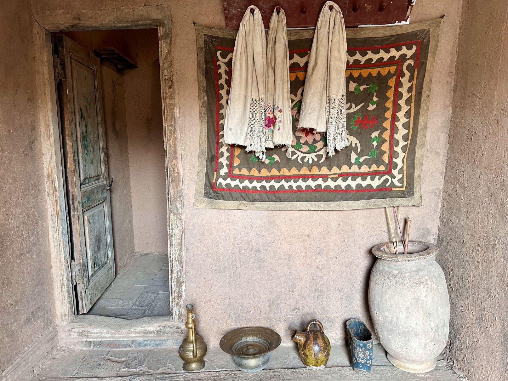
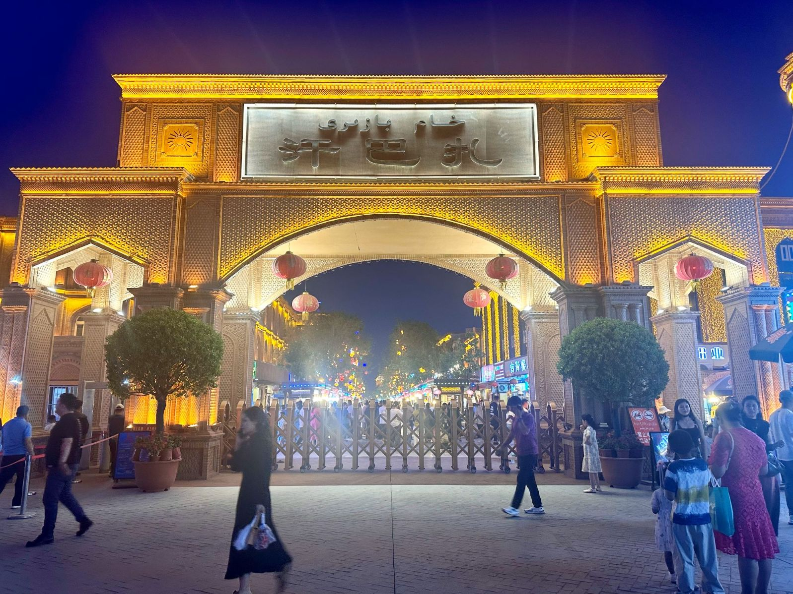
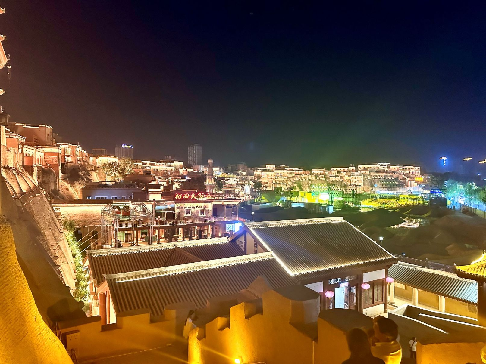
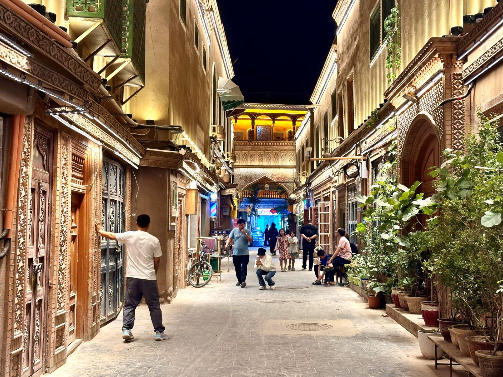

## China(Kashgar and Kizilsu Kyrgyz), 19/May/2024-22/May/2024

**[<u>RAILWAYS IN XINJIANG, CHINA</u>](https://wqgcx.github.io/transport/20240519CN/CR/)**

**Fly China United Airlines and China Southern Airlines to Kashgar(KN5611, CZ6998)**

**19/May/2024: Kashgar(喀什)**

艾提尕尔清真寺

买买提的老房子

高台民居

喀什古城

**20/May/2024: Kashgar(喀什), Kizilsu Kyrgyz(克孜勒苏柯尔克孜)**

**Fly China Southern Airlines to Tashkurgan(CZ8601)**

**21/May/2024: Kizilsu Kyrgyz(克孜勒苏柯尔克孜)**

**22/May/2024: Aksu(阿克苏)**

**Fly Tianjin Airlines and China United Airlines to Beijing(GS7478, KN5612)**

**Click [here](https://wqgcx.github.io/transport/) to go back.**
