## Japan, 21/06/2024-24/06/2024

**[<u>RAILWAYS IN JAPAN</u>](https://wqgcx.github.io/transport/20240621JP/JR/)**

**Fly China Eastern to Nagoya(MU5196, MU291)**

**21/06/2024: Ise-shi(伊勢市), Nagoya-shi(名古屋市)**

Futamiokitama Shrine(二見興玉神社)

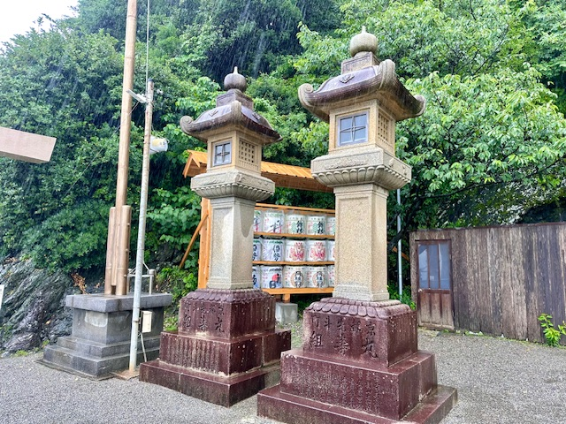

Ise Shrine(伊勢神宮)

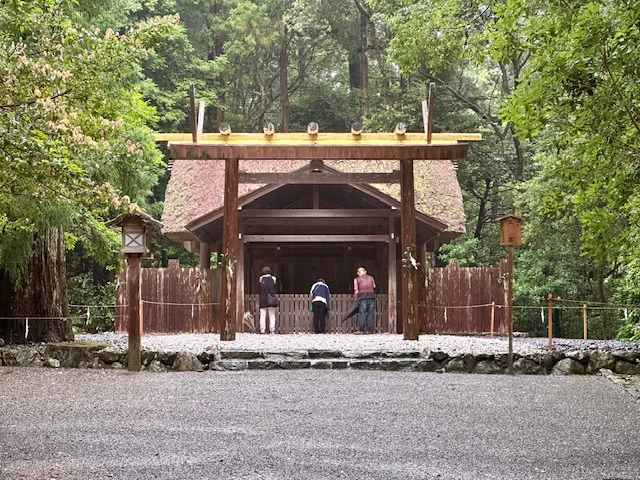

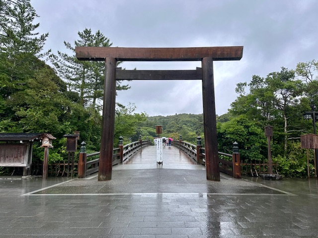

Atsuta Shrine(熱田神宮)

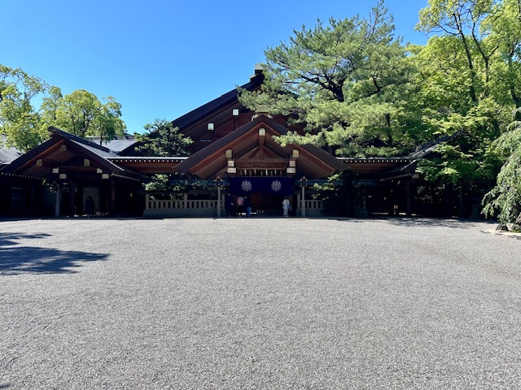

Ōsu Kannon(大須観音)

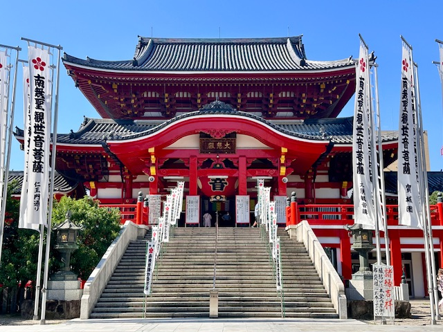
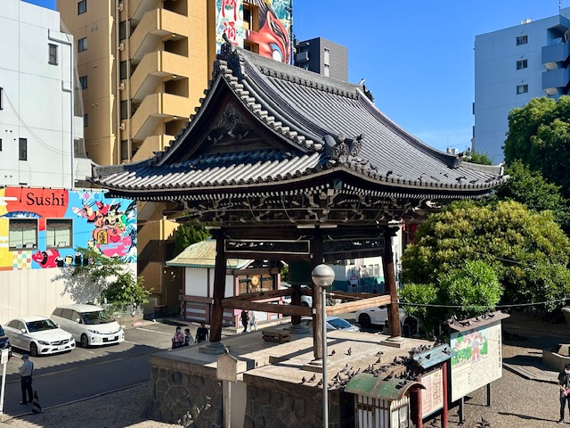
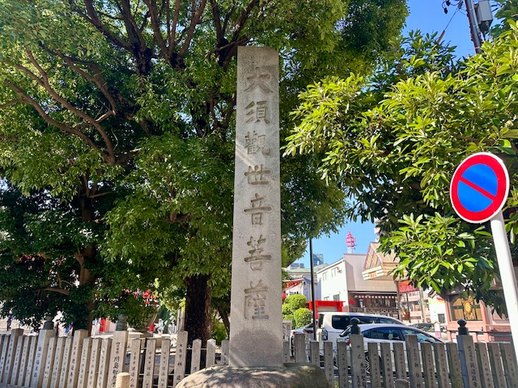

Nagoya Castle(名古屋城)

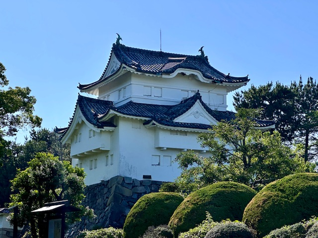

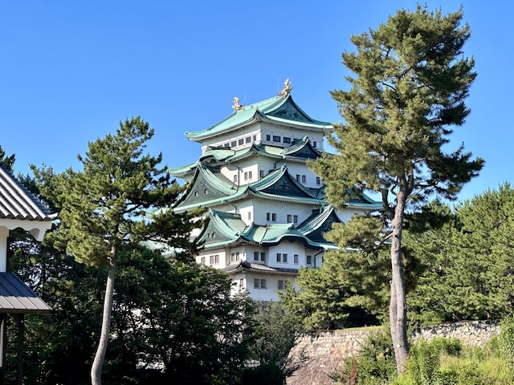

Tōgan-ji(桃嚴寺)

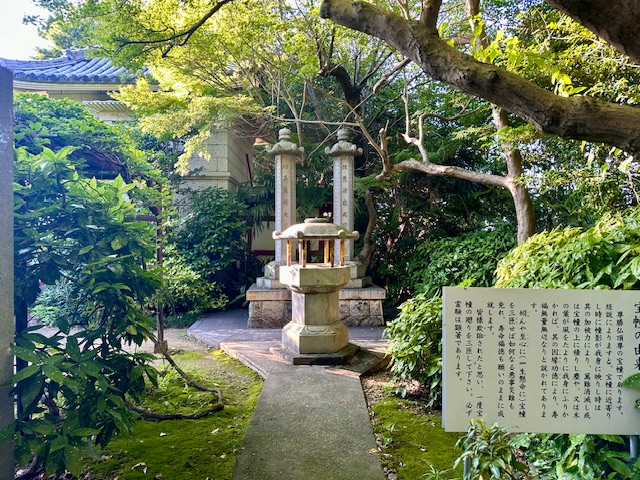

Nagoya City View(Chubu Electric Power MIRAI TOWER, 中部電力 MIRAI TOWER)

Izakaya(居酒屋) 

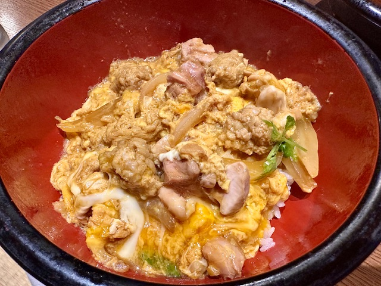

Nagoya Night View

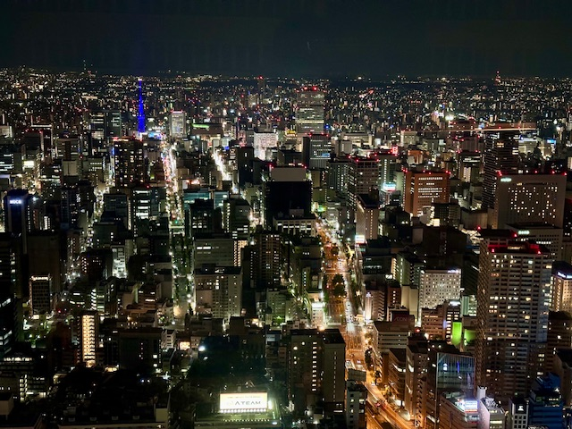

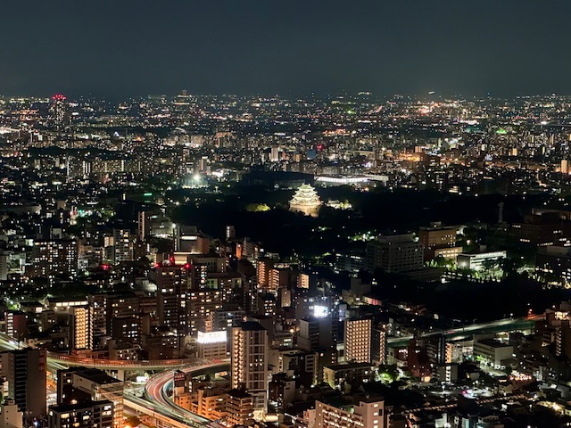

**22/06/2024: Takayama-shi(高山市), Shirakawa-mura(白川村)**

Hida Tenmangu Shrine(飛騨天滿宮)

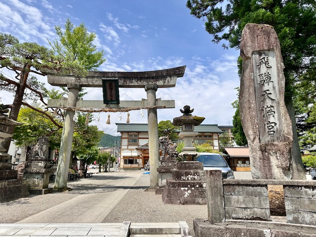
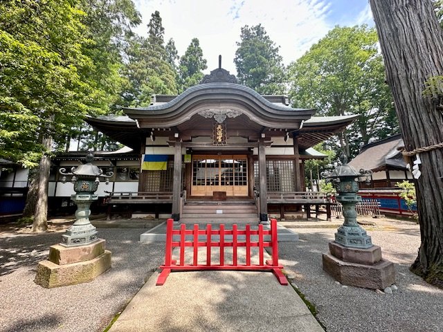
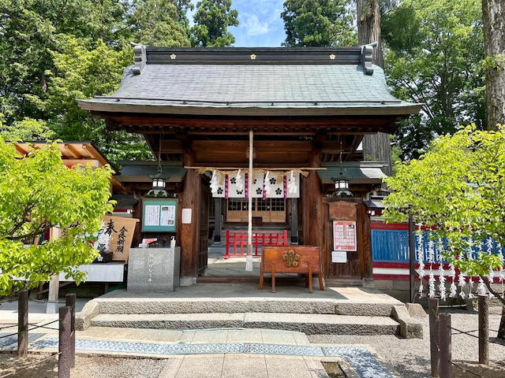

Hie Shrine(飛騨山王宮 日枝神社)

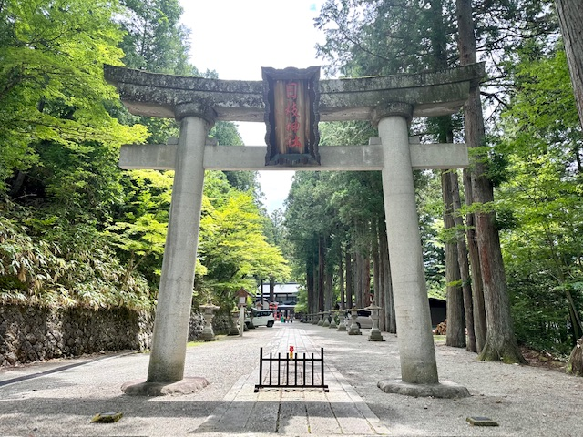

Takayama Jinya(高山陣屋)

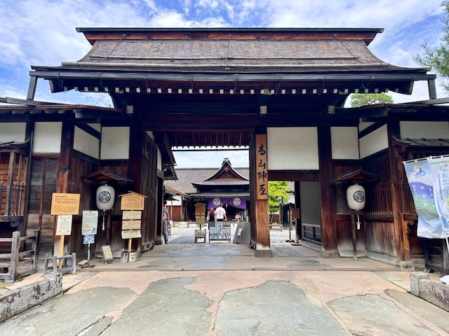
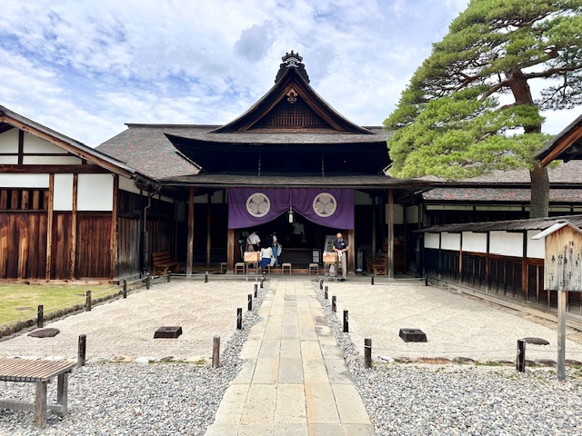

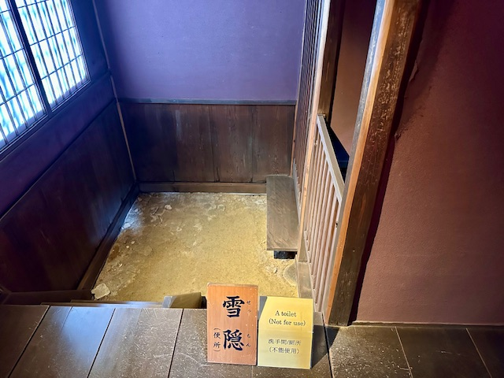

Traditional Japanese Cuisine with Soba Noodles(蕎麦), Hida Beef Sushi(飛騨牛握り寿司) and Tempura(天婦羅).

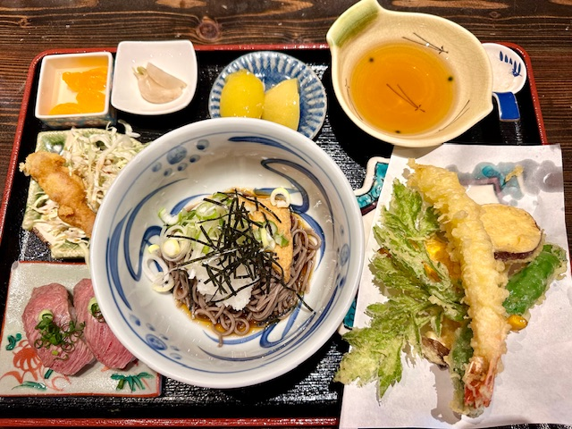

Takayama Street View

Sakurayama Hachimangu Shrine(櫻山八幡宮)

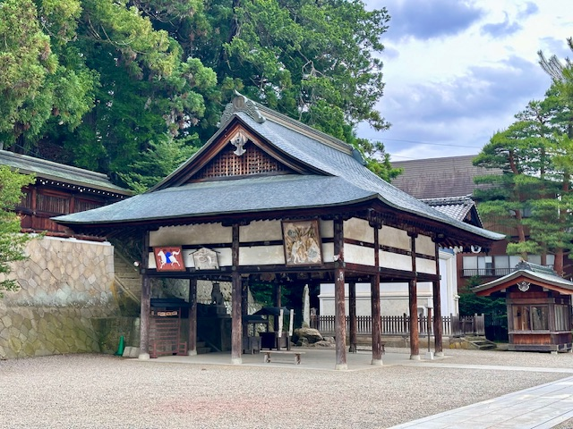

Hida Kokubun-ji(飛騨国分寺)

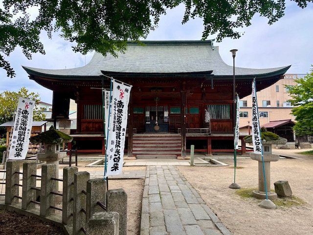

Gasshōzukuri(合掌造り)

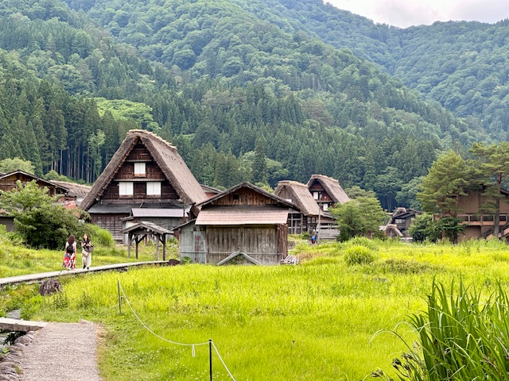

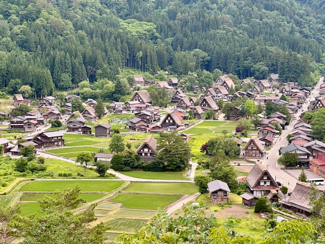

**23/06/2024: Kanazawa-shi(金沢市), Takaoka-shi(高岡市), Toyama-shi(富山市)**

**24/06/2024: Tateyama Kurobe Alpine Route(立山黒部アルペンルート), Matsumoto-shi(松本市)**

**Fly China Eastern to Beijing(MU530, MU5195)**

**Click [here](https://wqgcx.github.io/transport/) to go back.**
