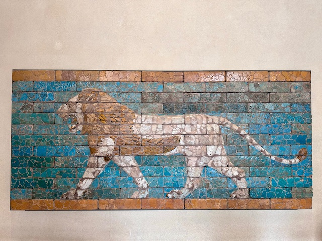

## Schengen Area(FR, CH, BE, DK), 30/Sep/2024-08/Oct/2024

**[<u>RAILWAYS IN SCHENGEN AREA</u>](https://wqgcx.github.io/transport/20240930EU/ER)**

**Fly Emirates to Paris(EK347, EK71)**

**30/Sep/2024: Paris**

Arc de Triomphe and Flame of Liberty Memorial

Trocadéro Palace

Eiffel Tower

Pont Alexandre III and Palais Garnier

Hôtel des Invalides

Place de la Concorde and Vendôme Column

Grand Palais, Petit Palais and National Assembly

Bateaux Mouches and Night View of Paris(along the Seine River)

**01/Oct/2024: Geneva, Lausanne, Bern**

Palace of Nations

Grand Théâtre de Genève, Musée Rath and Monument to the Reformation

Evangelical Lutheran Church of Geneva, Palais de Justice and St. Pierre Cathedral

City View of Geneva, The Flower Clock and Basilica of Our Lady of Geneva

Lake Geneva

Lausanne Cathedral

City View of Lausanne

Olympic Museum

Church of the Holy Spirit, Käfigturm(Prison Tower) and Clock Tower

Bern Minster and Einsteinhaus

City View of Bern

**02/Oct/2024: Zurich, Schwyz, Lucerne, Bern**

Zurich Old Town(St. Peter, Fraumünster, Grossmünster, Opernhaus, Limmat River)

Mountain Rigi

Lake Lucerne

Chapel Bridge

City View of Lucerne(City Hall, Jesuit Church and Hotel Château Gütsch)

Panoramic of Lucerne, The Lion Monument and Church of St. Leodegar

GoldenPass Line

City View of Thun

**03/Oct/2024: Schaffhausen, Zurich, Basel**

Rhine Falls

City View of Schaffhausen(Haus zum Ritter, Church of St. Johann, Panorama)

Munot

Swiss National Museum

Kunstmuseum Basel

Basel Minster, Basel Town Hall, Gate of Spalen

**04/Oct/2024: Paris**

Palais de Louvre

Church of Saint-Germain l'Auxerrois, Place du Châtelet and Hôtel de Ville(City Hall)

Church Saint-Gervais-Saint-Protais, Church Saint-Paul-Saint-Lous and Place de la Bastille

Maison de Victor Hugo(Victor Hugo's House)

Château de Vincennes

Night View of Paris(on the Tour Montparnasse)

**05/Oct/2024: Brussels, Antwerp, Ghent**

Halle Gate, Palace of Justice(Brussels) and Minimes Church

Church of Our Lady of Victories at the Sablon, Oldmasters Museum and Church of St. James on Coudenberg

Brussels Town Hall, Royal Saint-Hubert Galleries and Manneken Pis

Grand-Place(the Central Square of Brussels)

Cathedral of St. Michael and St. Gudula, and Berlaymont Building(European Commission)

Cinquantenaire Park

Atomium

**06/Oct/2024: Paris**

**07/Oct/2024: Copenhagen**

**08/Oct/2024: Paris**

**Fly Emirates and China Eastern Airlines to Beijing(EK76, EK342, MU796)**

**Click [here](https://wqgcx.github.io/transport/) to go back.**
