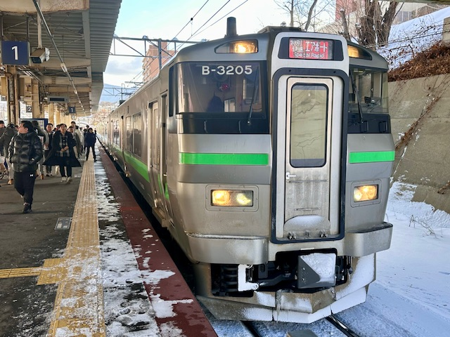
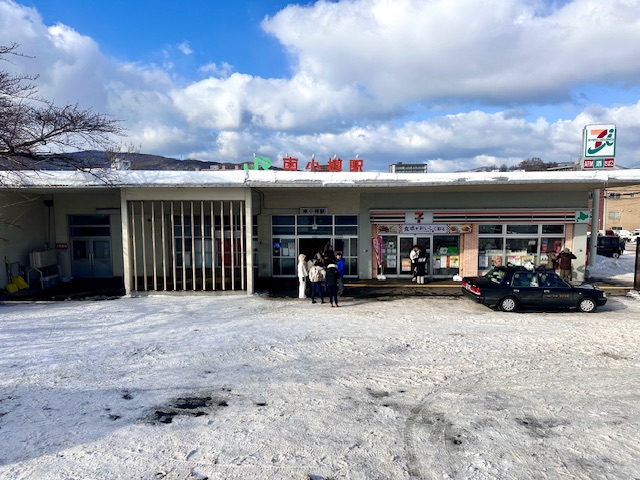

## Railways in Japan

Hover over the image to find out the type of the train or which train station it is.

**Trains**

**Stations**

**Click [here](https://wqgcx.github.io/transport/20241125JP/) to go back.**
