## Japan(Hiroshima, Okayama and Fukuoka), 25/Nov/2024-27/Nov/2024

**[<u>RAILWAYS IN JAPAN</u>](https://wqgcx.github.io/transport/20241125JP/JR)**

**Fly Shanghai Airlines and China Eastern Airlines to Hiroshima(FM9102, MU293)**

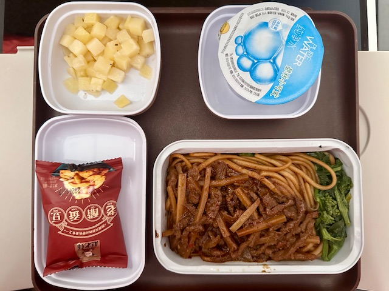

**25/Nov/2024: Fukuyama(福山), Kurashiki(倉敷)**

Fukuyama Castle(福山城)

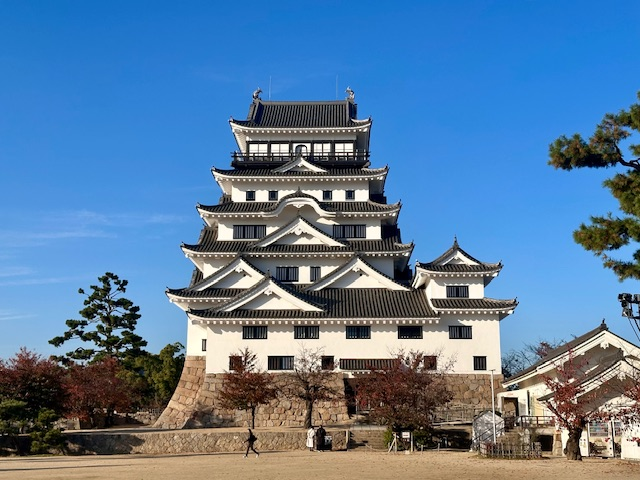
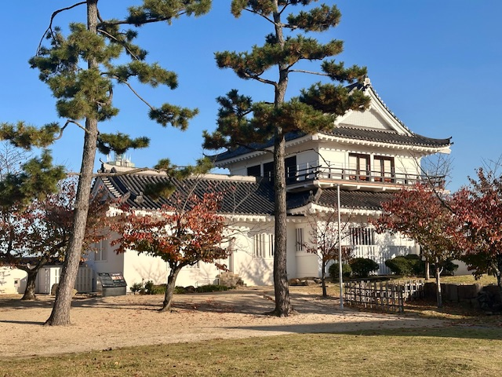
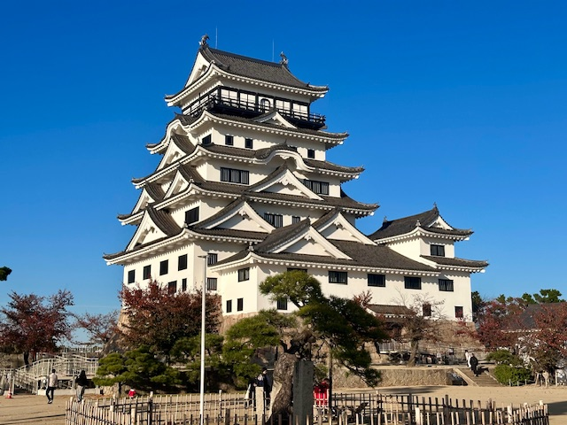
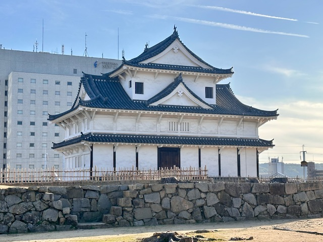
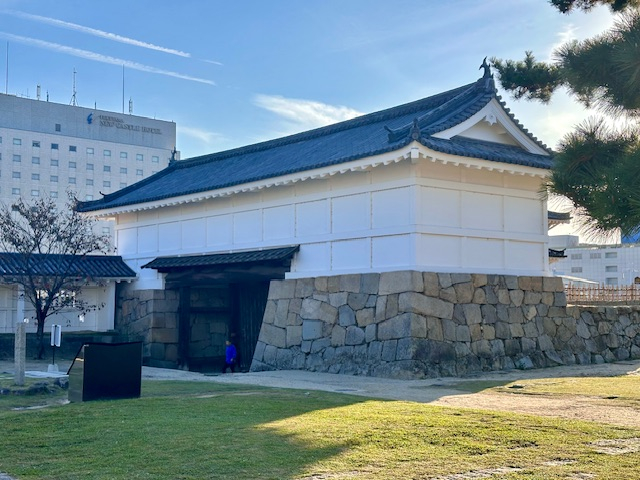
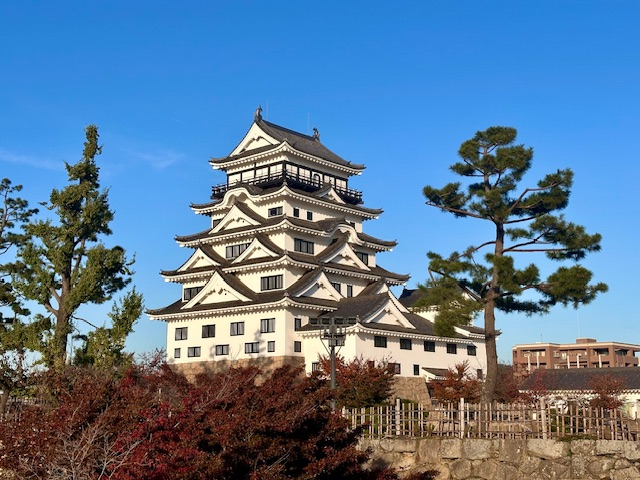
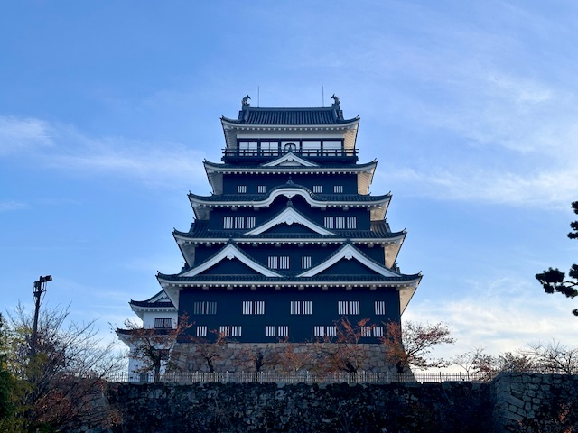
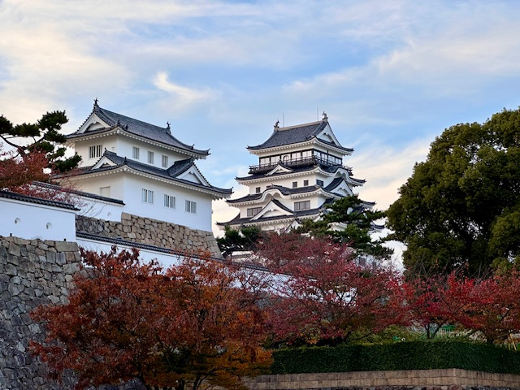
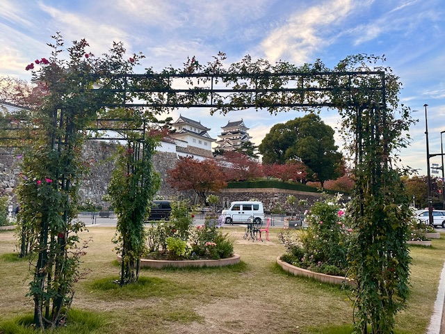

Fukuyama Hachimangu(福山八幡宮)

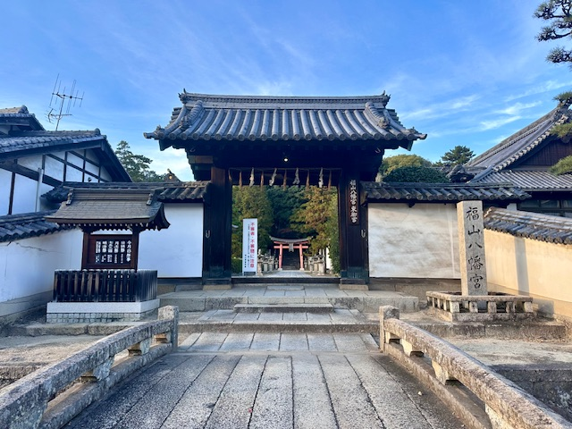
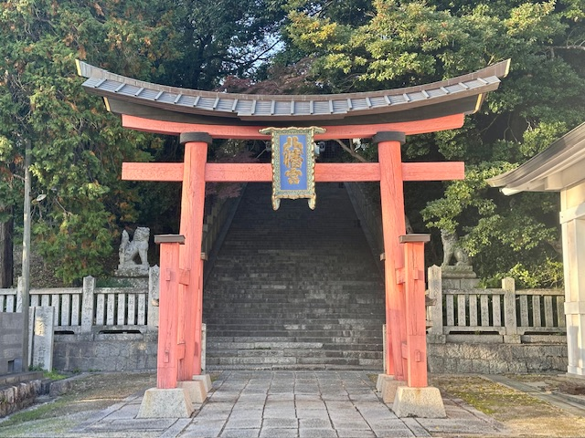
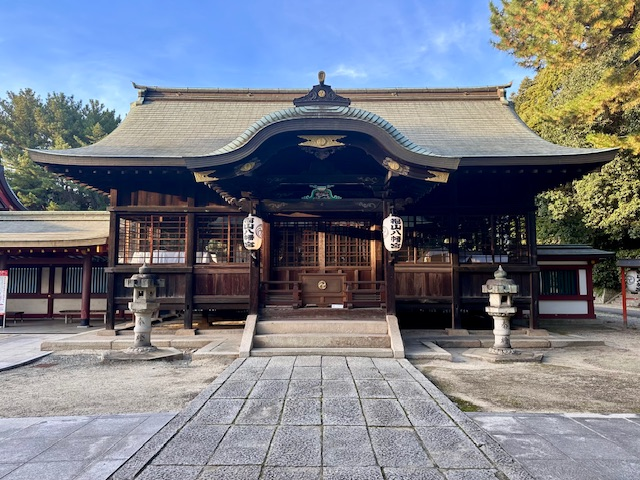
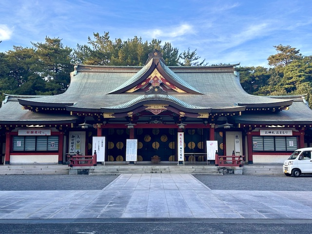

Kannon-ji Temple(観音寺)

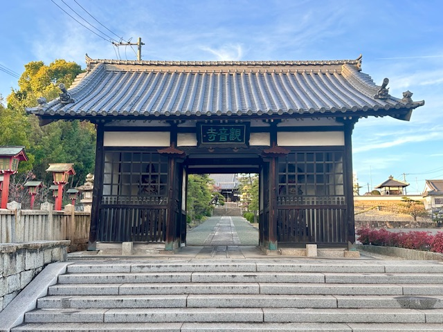
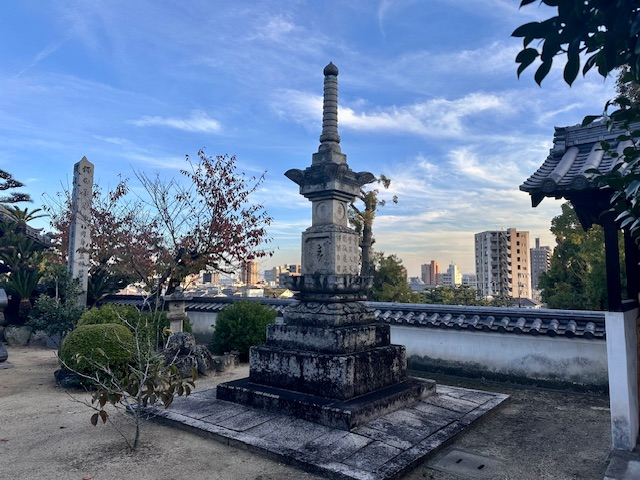
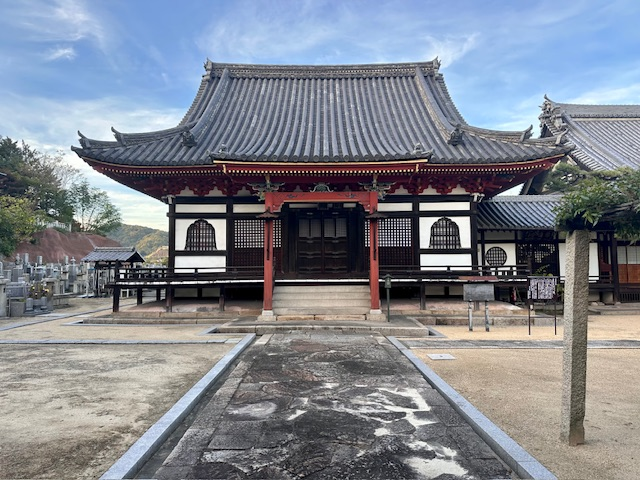
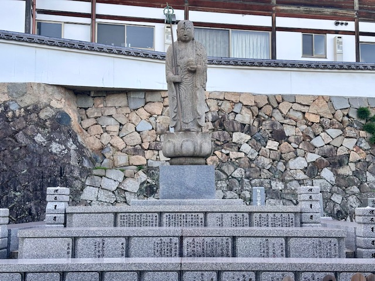
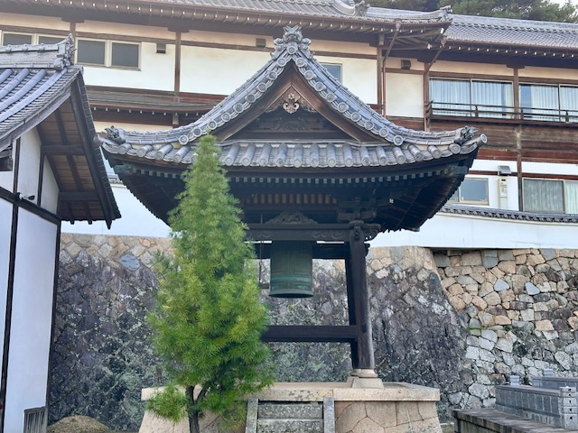

Ushitora Shrine(艮神社)

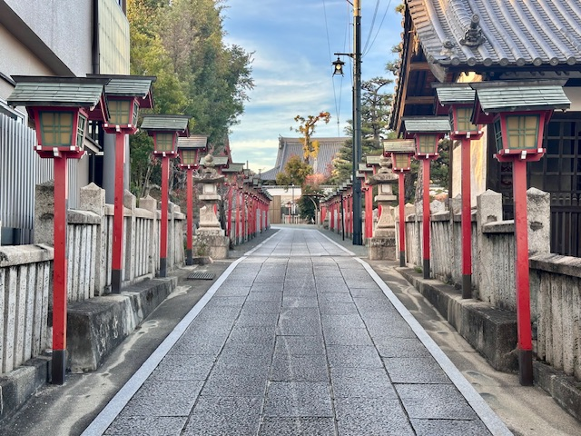
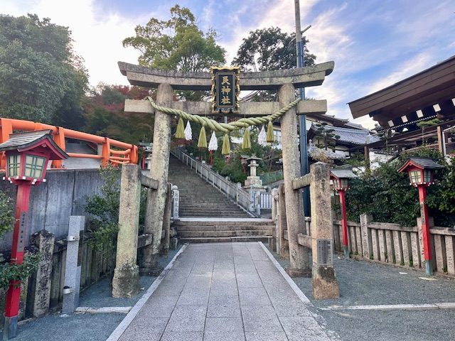
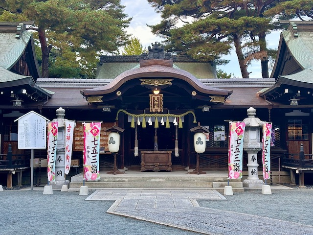

Tomonoura(鞆の浦)

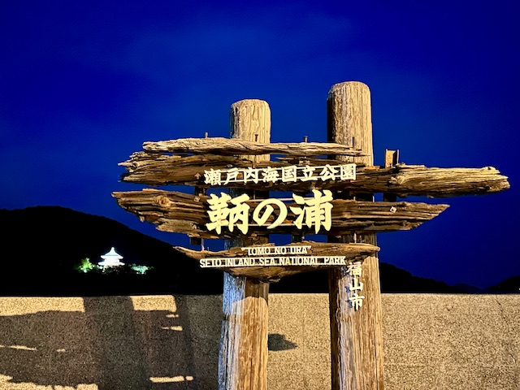
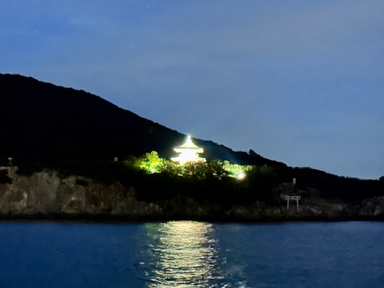
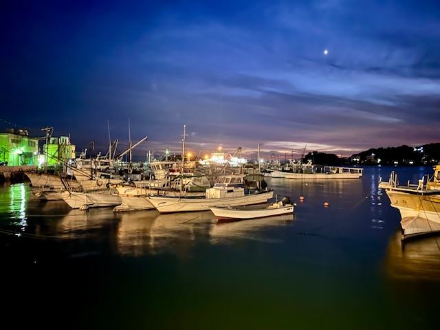
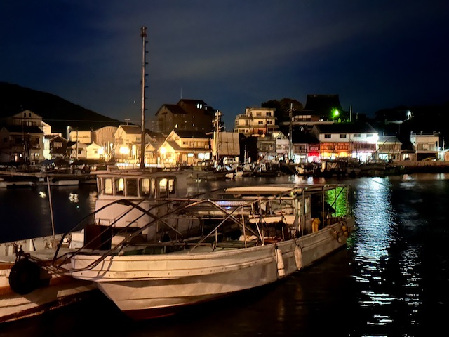
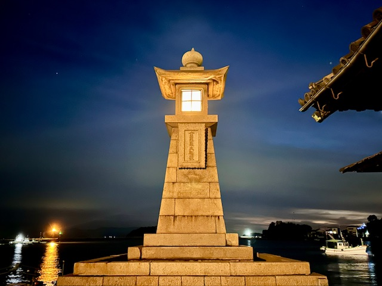

Hiroshima Ramen

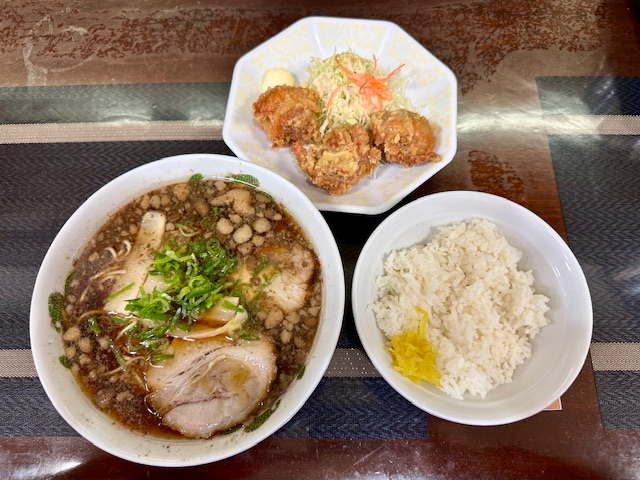

Kurashiki Bikan Historical Quarter(倉敷美観地区)

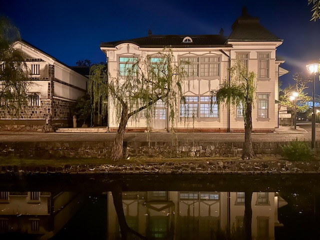
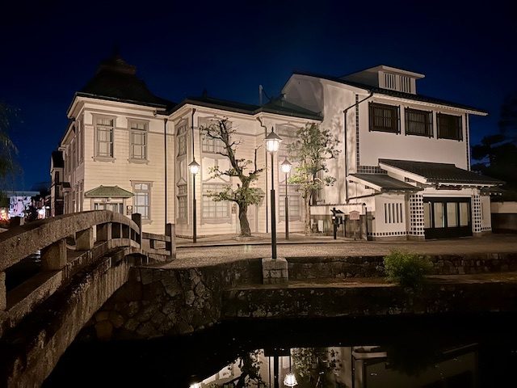
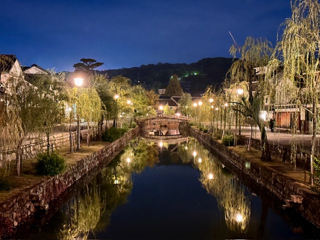

**26/Nov/2024: Kurashiki(倉敷), Okayama(岡山), Onomichi(尾道)**

**27/Nov/2024: Hiroshima(広島), Fukuoka(福岡)**

**Fly China Eastern Airlines to Beijing(MU5088, MU5165)**

**Click [here](https://wqgcx.github.io/transport/) to go back.**
