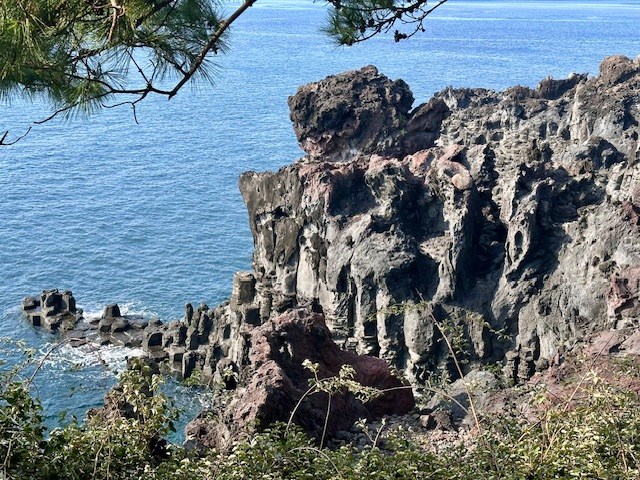

## Republic of Korea(Jeju Island), 02/Dec/2024-05/Dec/2025

**Fly Spring Airlines to Jeju Island(9C7205)**

**03/Dec/2024: Jeju Island**

Jusangjeolli Cliff(주상절리대)

Cheonjeyeong Waterfall(천지연폭포)

Jeongbang Falls(정방폭포)

Oedolgae Rock(외돌개)

Jeju Seafood

**04/Dec/2024: Jeju Island**

Sunrise Peak(성산일출봉)

U Island(우도)

Seopjikoji(섭지코지)

Woljeongri Beach(월정리해변)

**Fly Spring Airlines to Beijing(9C7206)**

**Click [here](https://wqgcx.github.io/transport/) to go back.**
