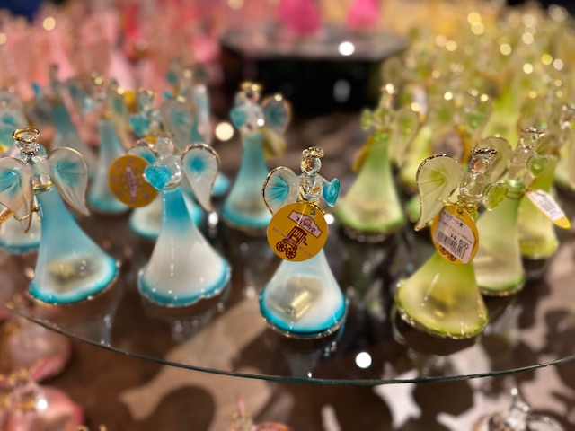
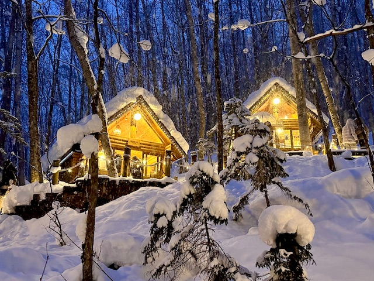

## Japan, 01/Jan/2025-08/Jan/2025

**[<u>RAILWAYS IN JAPAN</u>](https://wqgcx.github.io/transport/20250101JP/JR/)**

**Fly All Nippon Airways to Tokyo(NH962)**

**01/Jan/2025: Tokyo Metropolis(東京都)**

Kabukichō(歌舞伎町)

**02/Jan/2025: Otaru-shi(小樽市)**

**Fly All Nippon Airways to Hokkaido(NH53)**

Sumiyoshi Shrine(住吉神社)

Marchen Intersection(メルヘン交差点)

Otaru Music Box Museum(小樽オルゴール堂)

Kitaichi Glass Otaru(北一硝子館)

Street View of Otaru

Otaru Canal(小樽運河)

Tenguyama(天狗山)

**03/Jan/2025: Wakkanai-shi(稚内市)**

North Breakwater Dome(北防波堤ドーム)

Wakkanai Centennial Memorial Tower(開基百年記念塔) and Chihaku Koro Monument(稚泊航路記念碑)

Japan Coast Guard PL11 Rishiri(日本海上保安庁巡視船 PL11 りしり)

Hokumon Shrine(北門神社)

Cape Sōya(宗谷岬)

**04/Jan/2025: Biei-chō(美瑛町), Furano-shi(富良野市)**

Christmas Tree no Ki(クリスマスツリーの木)

Love Neil's Bell(ラヴニールの鐘)

Shirahige Waterfalls(白ひげの滝)

Blue Pond(青い池)

Ningle Terrace(ニングルテラス)

**05/Jan/2025: Asahikawa-shi(旭川市), Hakodate-shi(函館市)**

**06/Jan/2025: Hakodate-shi(函館市), Tōyako-chō(洞爺湖町), Noboribetsu-shi(登別市)**

**07/Jan/2025: Noboribetsu-shi(登別市), Sapporo-shi(札幌市)**

**Fly AirDo to Tokyo(HD38)**

**08/Jan/2025: Tokyo Metropolis(東京都)**

**Fly All Nippon Airways to Beijing(NH961)**

**Click [here](https://wqgcx.github.io/transport/) to go back.**
