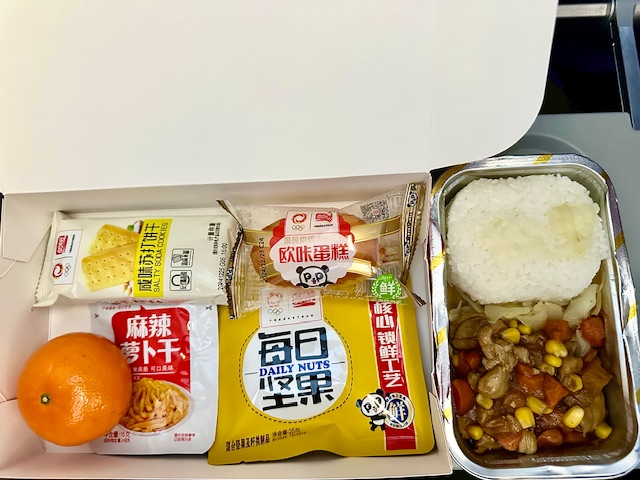

## Republic of Korea, China, Laos and Thailand, 14/Jan/2025-26/Jan/2025

**14/Jan/2025: Seoul, Republic of Korea**

**Fly China Southern Airlines to Seoul, Republic of Korea(CZ317)**

Seoul National Cemetery

Gyeonghuigung

Seodaemun Independence Park

Deoksugung

Namdaemun

**15/Jan/2025: Seoul, Republic of Korea**

Korean Demilitarized Zone

**16/Jan/2025: Seoul, Republic of Korea**

National Assembly of the Republic of Korea

National Palace Museum of Korea

Hwangudan

**Fly China Southern Airlines to Shenyang, China(CZ672)**

**17/Jan/2025: Xishuangbanna, China**

**Fly China Southern Airlines to Xishuangbanna, China(CZ8557)**

Peacock Banquet

The Great Pagoda Temple of Jinghong

Night View alongside the Lancang River

**18/Jan/2025: Xishuangbanna, China**

Manting Imperial Garden

Xishuangbanna General Buddhist Temple

Bo Re Temple

Mengle Cultural Park

Sapie Rice Noodles

**19/Jan/2025: Xishuangbanna, China**

**20/Jan/2025: Luang Prabang, Laos**

**Take Train C383 to Mohan Railway Station, China**

**Take Train D85 to Luang Prabang Railway Station, Laos**

**21/Jan/2025: Luang Prabang, Laos**

**Take Train C83 to Vientiane Railway Station, Laos**

**22/Jan/2025: Vientiane, Laos**

**Take Train 134 to Krung Thep Aphiwat Railway Station, Thailand**

**23/Jan/2025: Bangkok, Thailand**

**24/Jan/2025: Chiang Mai, Thailand**

**Fly Thai AirAsia to Chiang Mai, Thailand(FD3443)**

**Fly Nok Air to Bankok, Thailand(DD137)**

**25/Jan/2025: Bangkok, Thailand**

**Fly China Eastern Airlines to Kunming, China(MU9612)**

**26/Jan/2025: Nanchang, China**

**Fly China Eastern Airlines to Nanchang, China(MU5470)**

**Click [here](https://wqgcx.github.io/transport/) to go back.**
