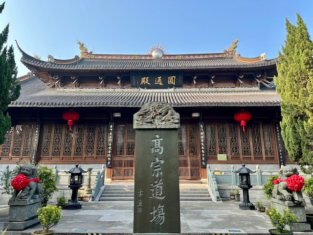
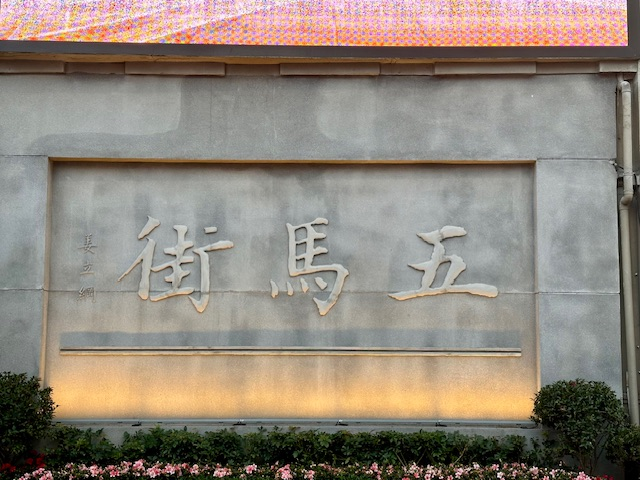
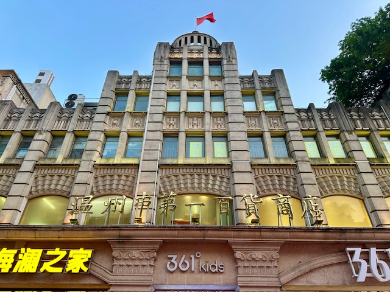
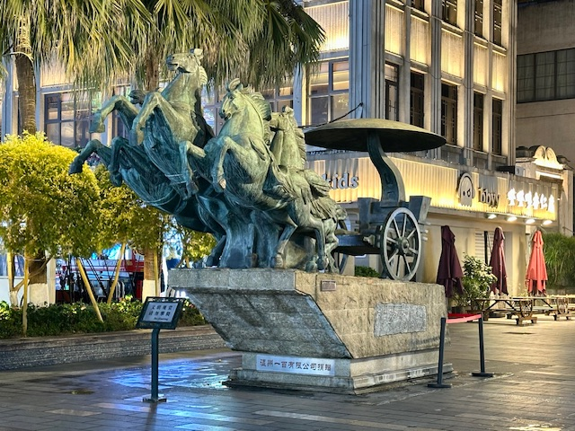
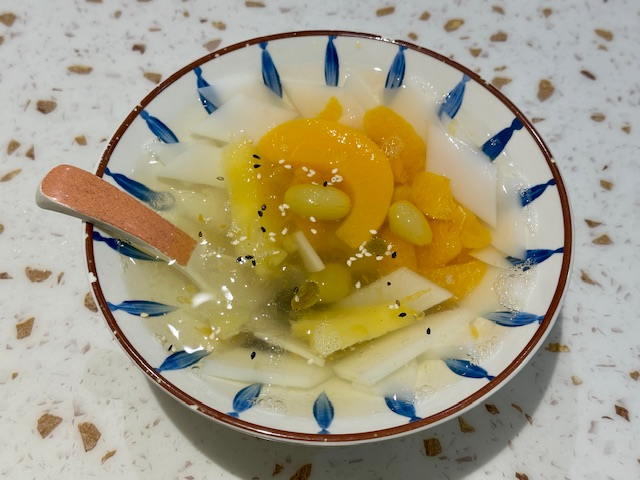
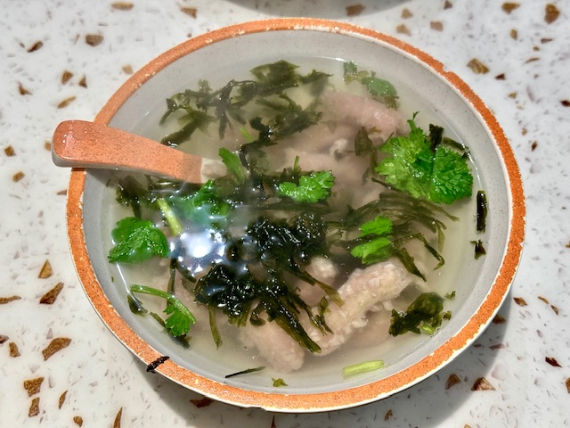
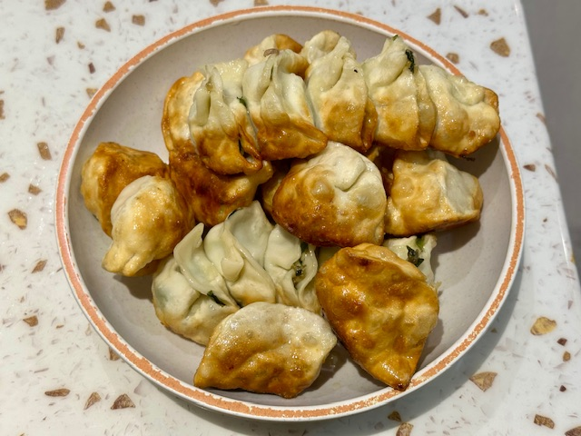
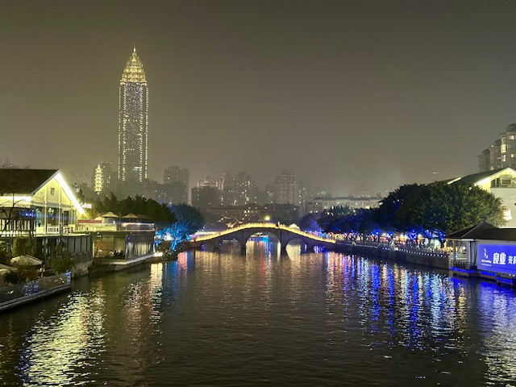

## China, 27/Feb/2025-02/Mar/2025

**Fly China United Airlines to Wenzhou(KN5915)**

**27/Feb/2025: 温州**

江心屿(外景)

江心屿(英国驻温州领事馆旧址)

江心屿(双塔)

江心屿(江心寺)

江心屿(浩然楼, 文天祥祠)

巽幽塔与温州世贸中心大厦

五马街

杏仁腐, 肉片汤和锅贴

印象南塘

**28/Feb/2025: 温州**

**01/Mar/2025: 温州**

**02/Mar/2025: 台州**

**Fly China United Airlines to Beijing(KN5982)**

**Click [here](https://wqgcx.github.io/transport/) to go back.**
