## Japan, 20/Mar/2025-24/Mar/2025

**[<u>RAILWAYS IN JAPAN</u>](https://wqgcx.github.io/transport/20250320JP/JR/)**

**Fly All Nippon Airways to Tottori(NH962, NH291)**

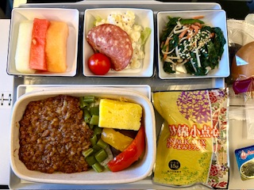

**21/Mar/2025: Tottori(鳥取), Shimane(島根)**

Tottori Sand Dunes Conan Airport(鳥取砂丘コナン空港)

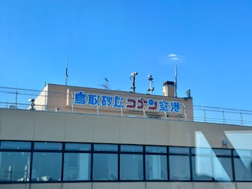
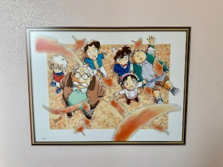
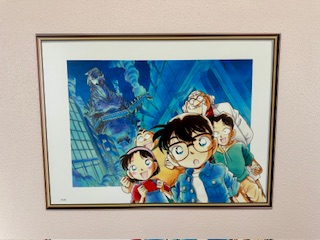
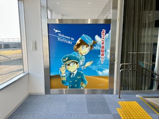
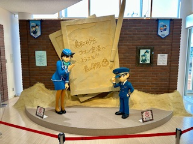
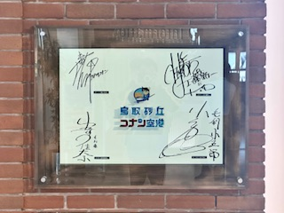
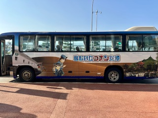
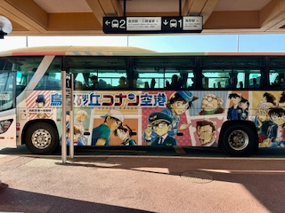

Tottori Sand Dunes(鳥取砂丘)

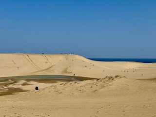
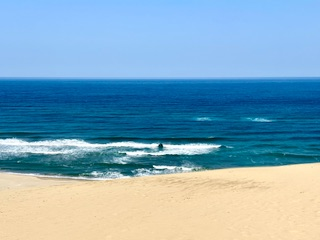
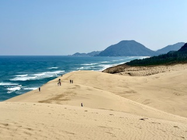
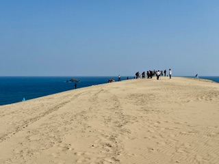
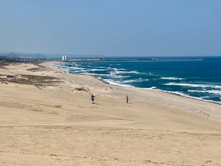
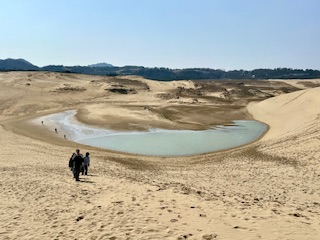

Tottori Castle Ruins(鳥取城跡)

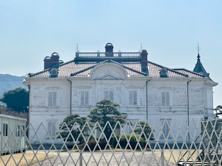
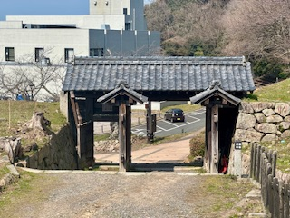
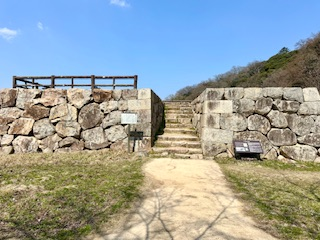
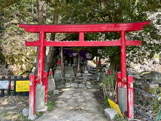
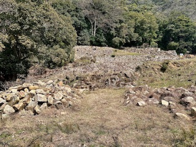
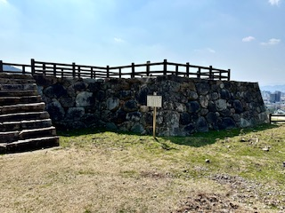

Hakuto Shrine and Hakuto Coast(白兎神社, 白兎海岸)

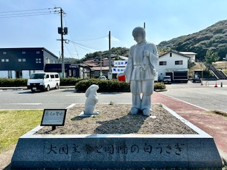
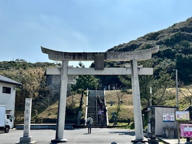
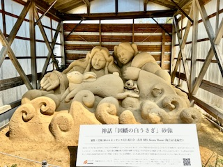
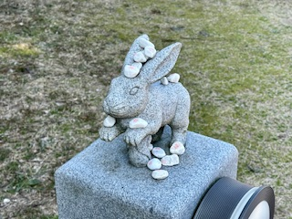
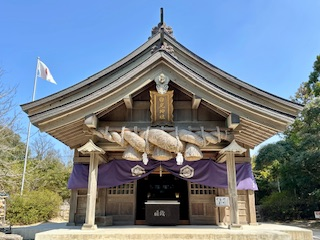

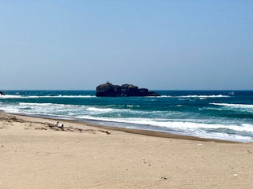
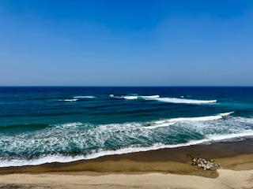
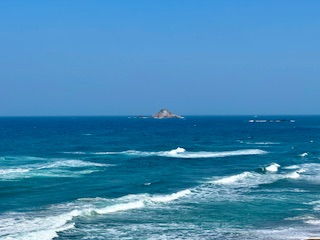

Lake Shinji(宍道湖)

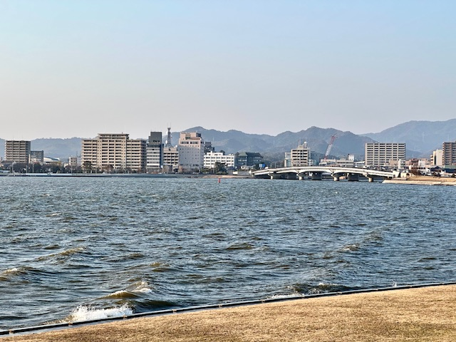
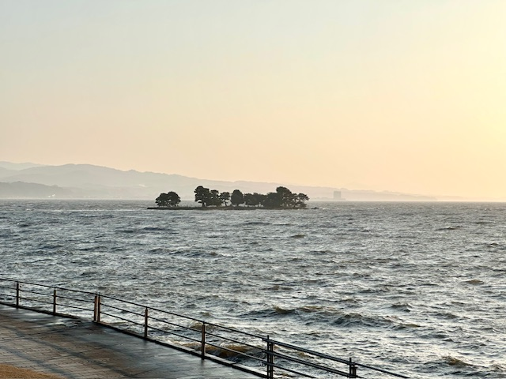
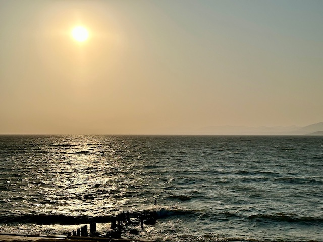
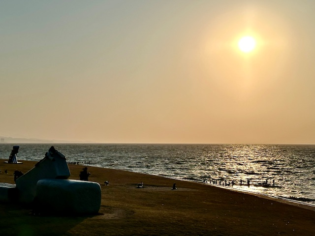
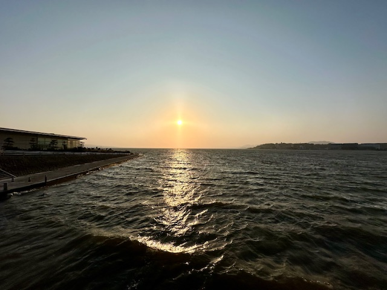

Japanese-Style Dinner

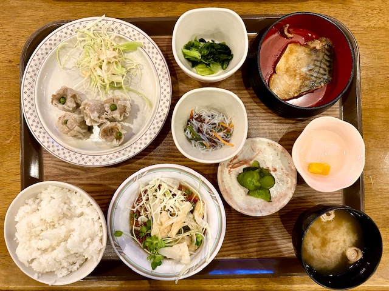

Matsue Castle(松江城)

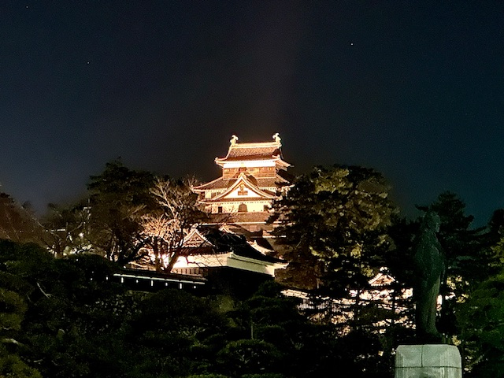
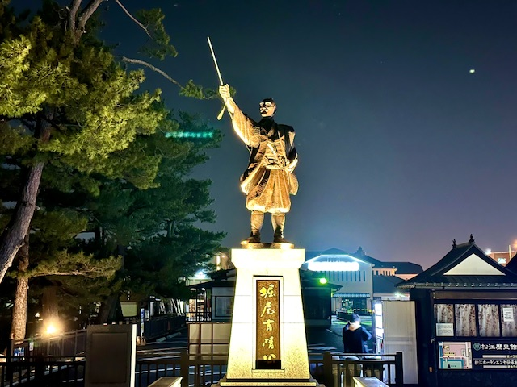

**22/Mar/2025: Shimane(島根), Tottori(鳥取)**

Izumo Oyashiro Shrine(出雲大社)

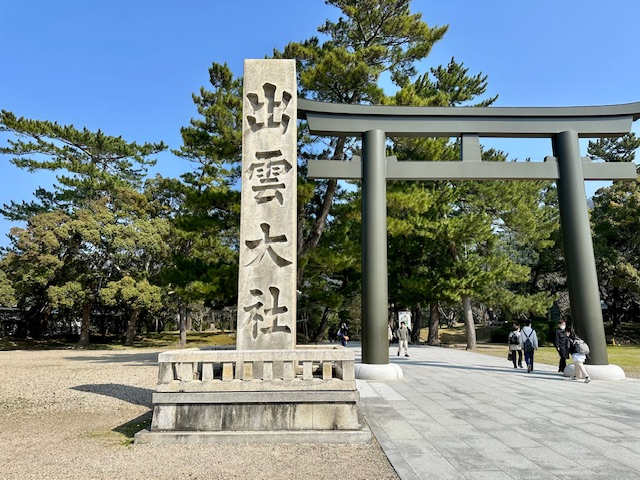
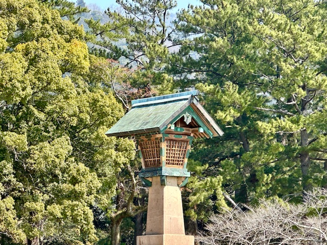
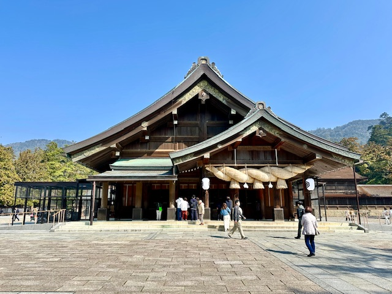
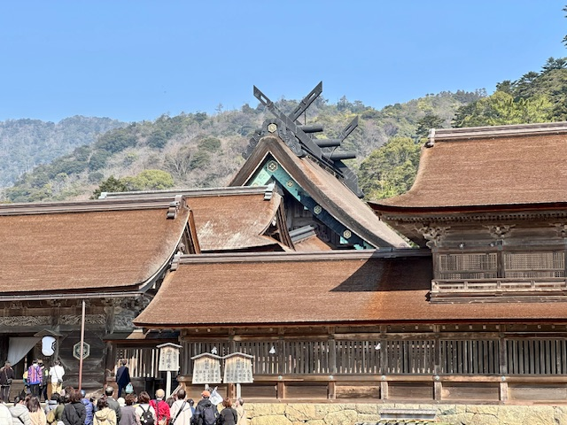
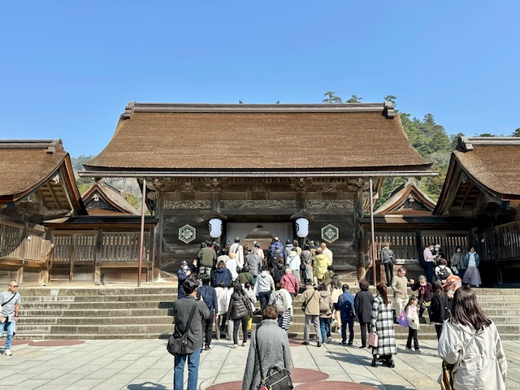
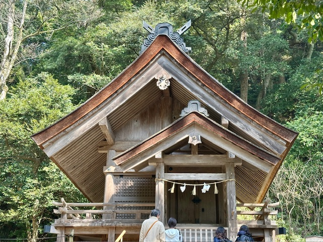
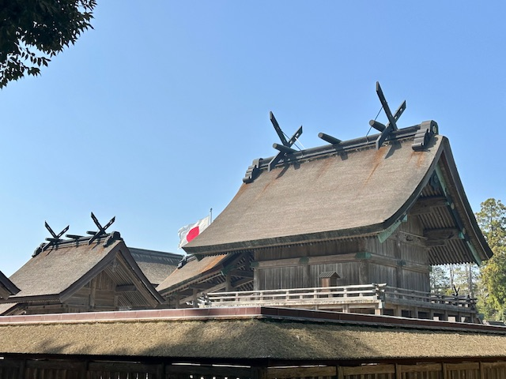
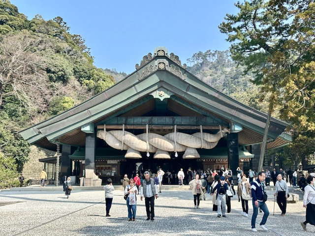
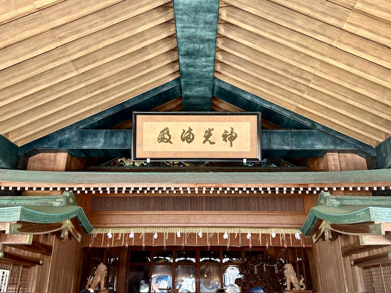

Inasa Beach(稲佐の浜)

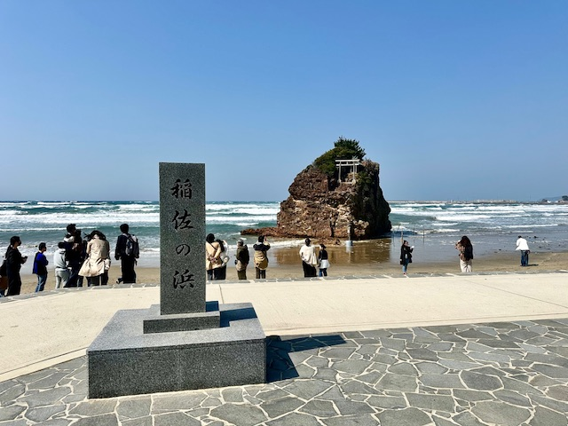
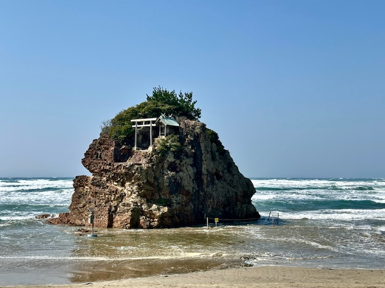
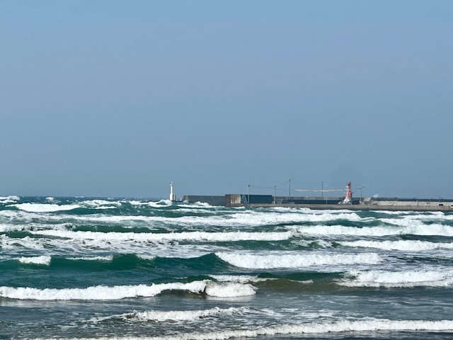

Momotaro at Yonago Station(米子駅の桃太郎)

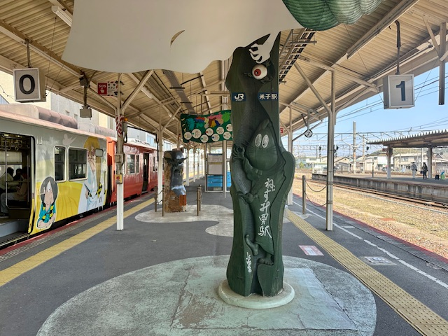

Momotaro-Painting Train(桃太郎塗装電車)

Mizuki Shigeru Road(水木しげるロード)

Youkai Shrine(妖怪神社)

Mizuki Shigeru Museum(水木しげる記念館)

**23/Mar/2025: Shimane(島根), Tottori(鳥取)**

Mastue Castle(松江城)

Mastue Shrine(松江神社)

Panorama of Mastue

Samurai Residence(武家屋敷)

Adachi Museum of Art(足立美術館)

Hokuei: World of Conan(北栄町: コナンの世界)

Gosho Aoyama Manga Factory(青山剛昌ふるさと館)

**24/Mar/2025: Saitama(埼玉)**

**Fly All Nippon Airways to Tokyo(NH294)**

Kawagoe Hachimangu(川越八幡宮)

Kitain Temple(喜多院)

Kawagoe Castle(川越城)

Kawagoe Hikawa Shrine(川越氷川神社)

City View of Kawagoe

Kawagoe Kumano Shrine(川越熊野神社)

**Click [here](https://wqgcx.github.io/transport/) to go back.**
