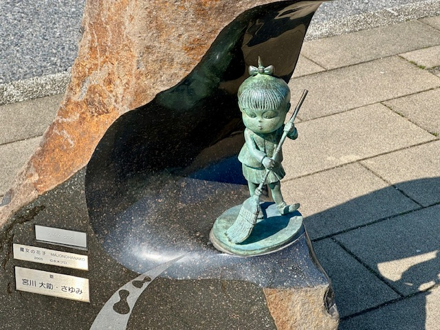

## Japan, 20/Mar/2025-24/Mar/2025

**[<u>RAILWAYS IN JAPAN</u>](https://wqgcx.github.io/transport/20250320JP/JR/)**

**Fly All Nippon Airways to Tottori(NH962, NH291)**

**21/Mar/2025: Tottori(鳥取), Shimane(島根)**

Tottori Sand Dunes Conan Airport(鳥取砂丘コナン空港)

Tottori Sand Dunes(鳥取砂丘)

Tottori Castle Ruins(鳥取城跡)

Hakuto Shrine and Hakuto Coast(白兎神社, 白兎海岸)

Lake Shinji(宍道湖)

Japanese-Style Dinner

Matsue Castle(松江城)

**22/Mar/2025: Shimane(島根), Tottori(鳥取)**

Izumo Oyashiro Shrine(出雲大社)

Inasa Beach(稲佐の浜)

Momotaro at Yonago Station(米子駅の桃太郎)

Momotaro-Painting Train(桃太郎塗装電車)

Mizuki Shigeru Road(水木しげるロード)

Youkai Shrine(妖怪神社)

Mizuki Shigeru Museum(水木しげる記念館)

**Click [here](https://wqgcx.github.io/transport/) to go back.**
