## China(Linfen and Yuncheng), 05/Apr/2025-07/Apr/2025

**[<u>RAILWAYS IN SHANXI, CHINA</u>](https://wqgcx.github.io/transport/20250405CN/CR/)**

**05/Apr/2025: 临汾**

广胜寺

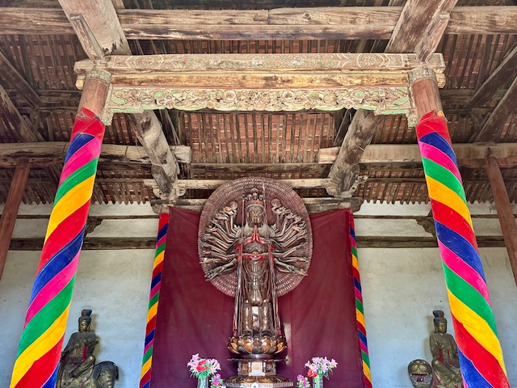
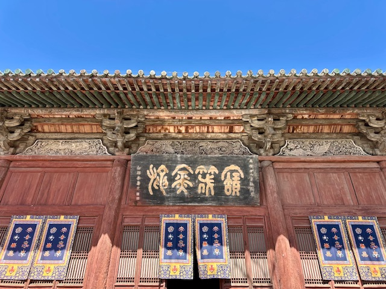
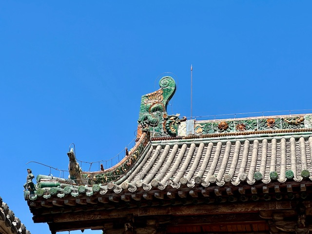
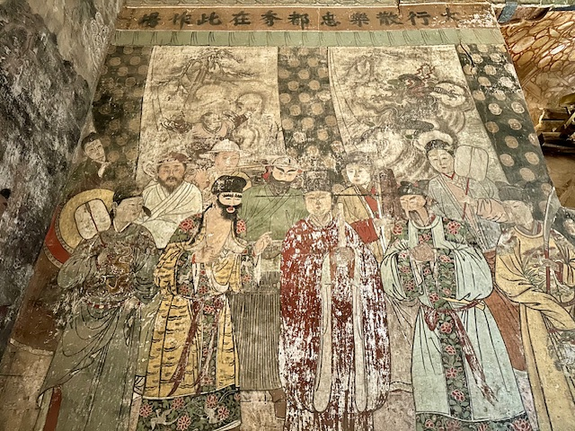
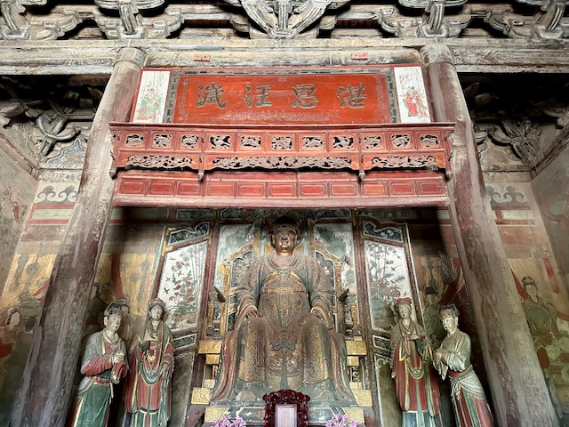
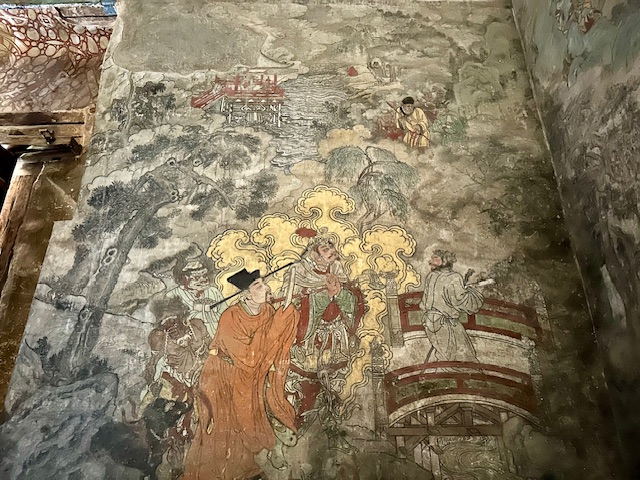
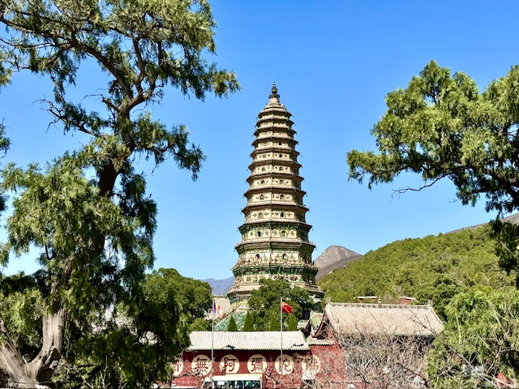
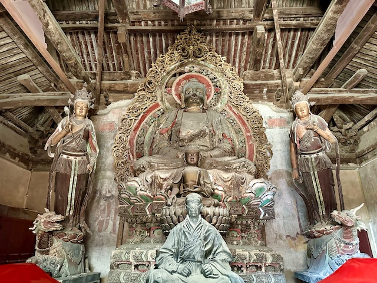

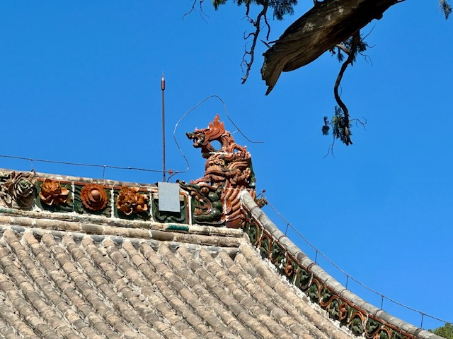
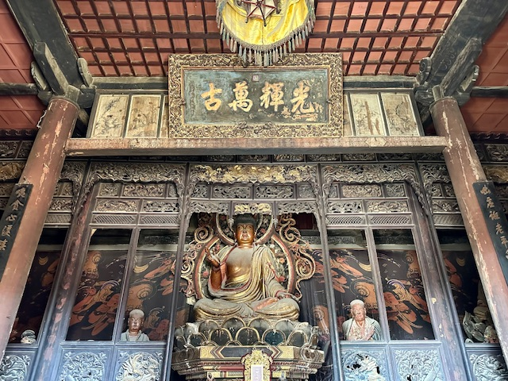
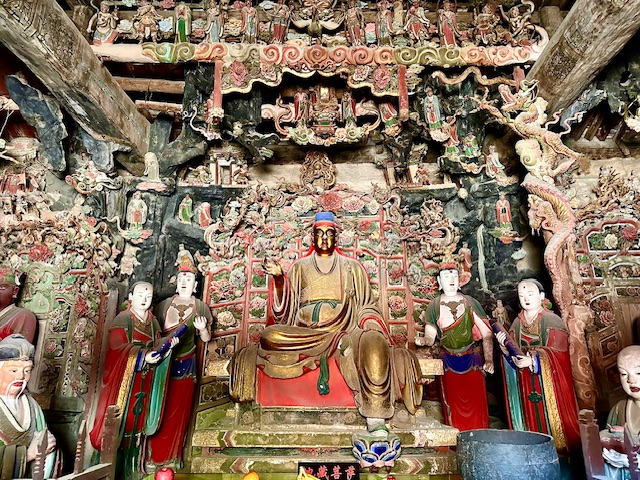
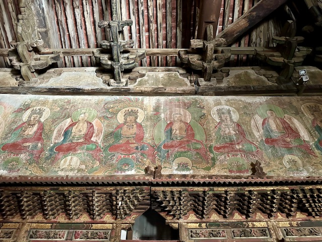

铁佛寺

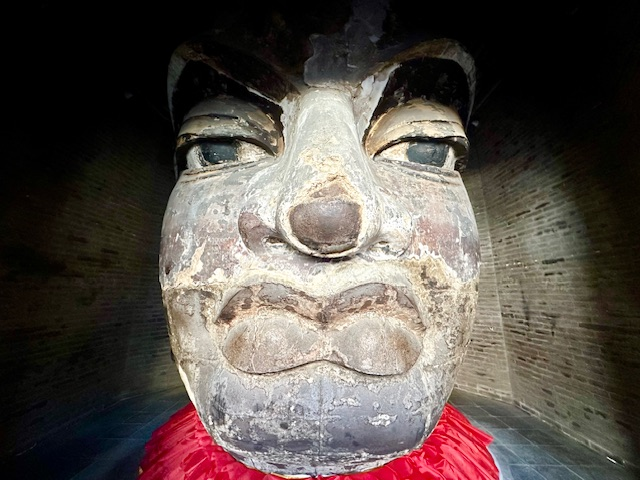
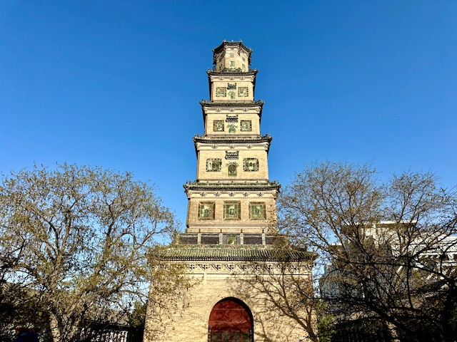
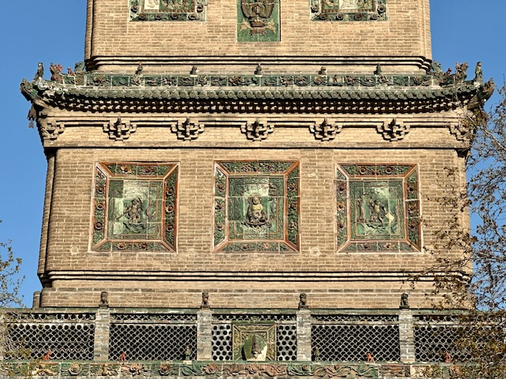
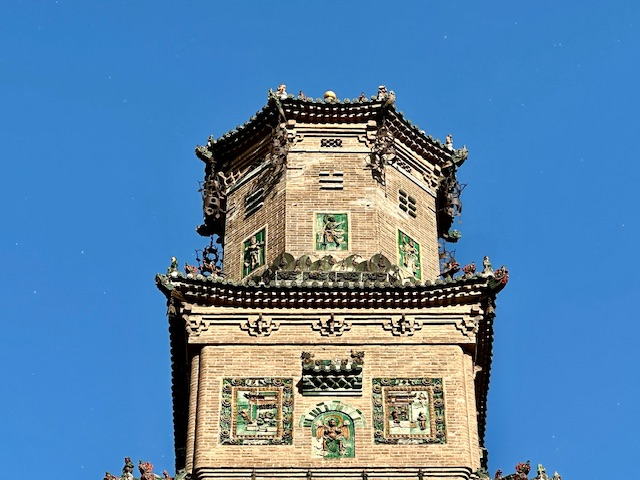
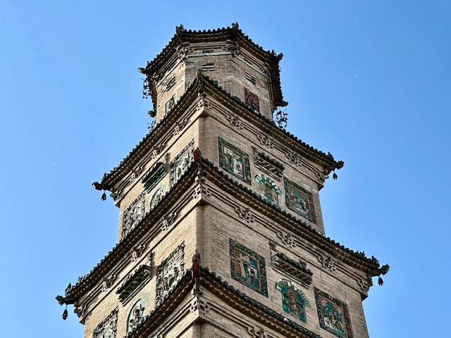

尧庙

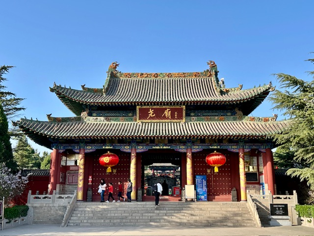
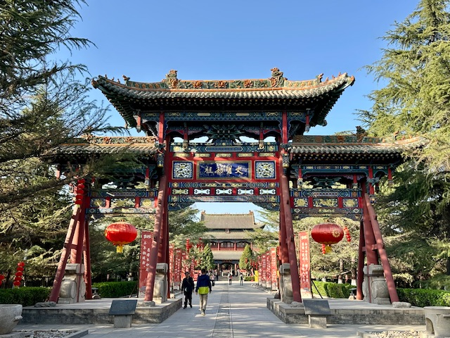
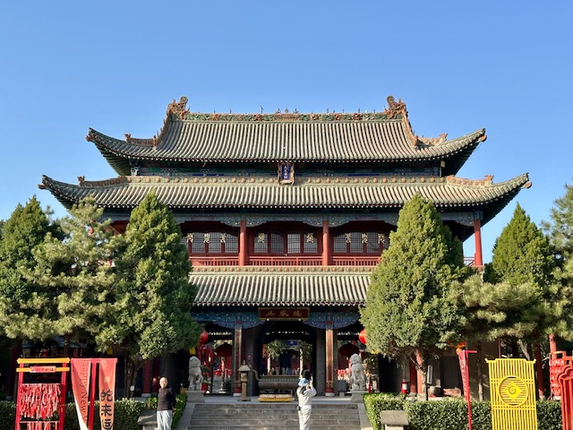
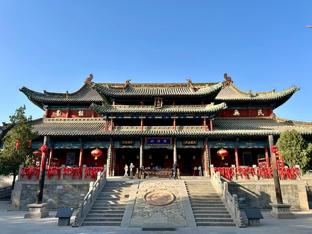
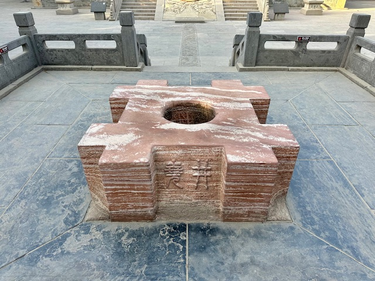

华门

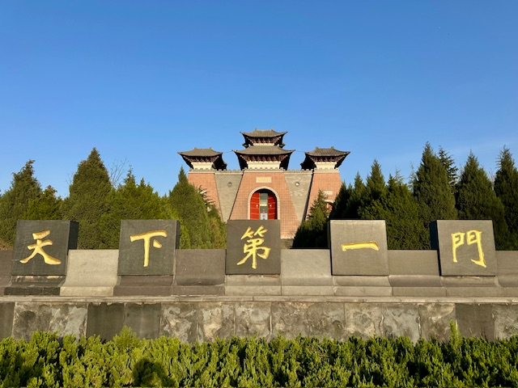
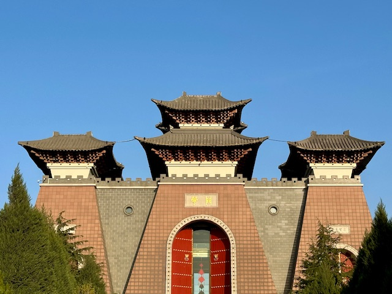

临汾鼓楼

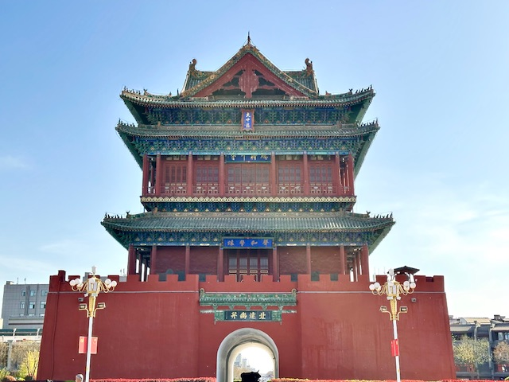
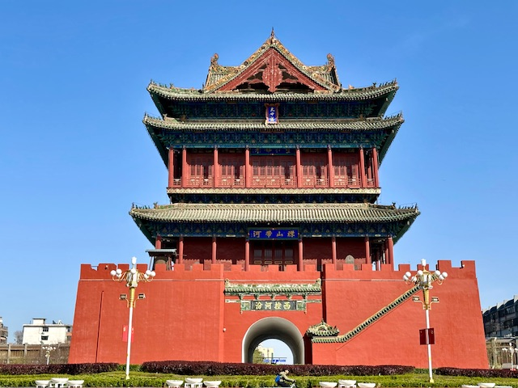
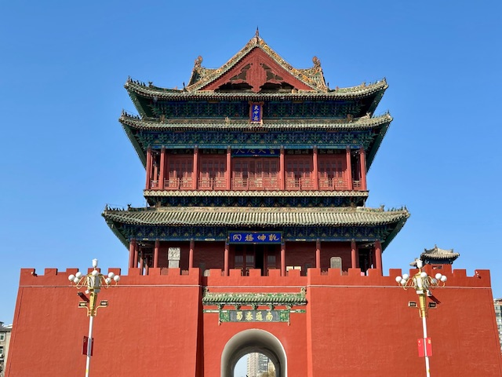
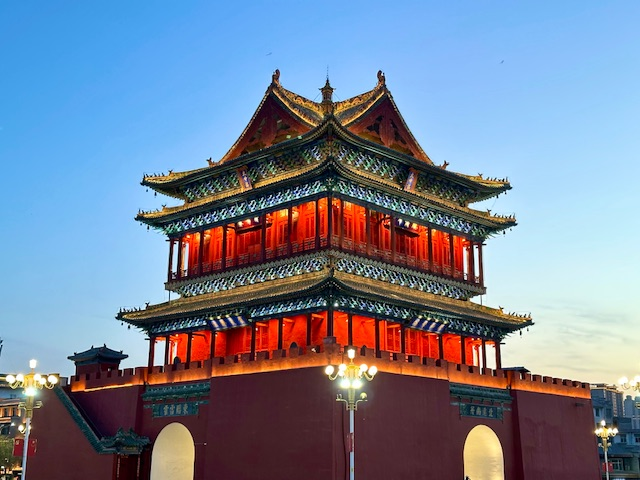
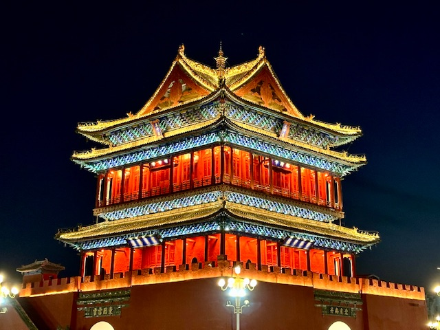
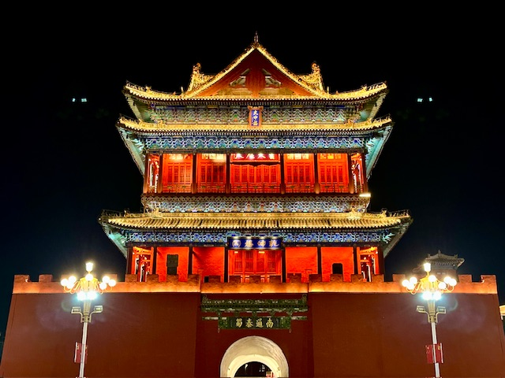

**06/Apr/2025: 临汾**

壶口瀑布

隰县小西天

蒲县东岳庙

**07/Apr/2025: 临汾, 运城**

灵光寺琉璃塔

汾城古建筑群

新绛福胜寺

稷山稷王庙

马村砖雕墓

稷山青龙寺

万荣东岳庙

**Click [here](https://wqgcx.github.io/transport/) to go back.**
