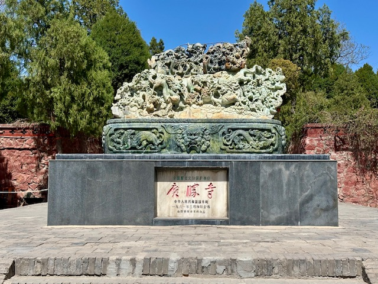
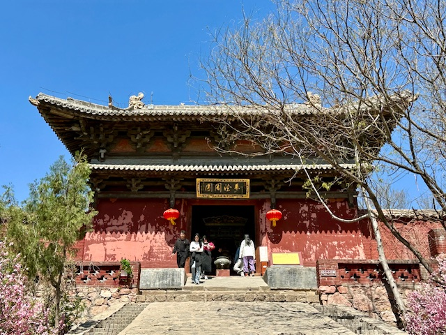

## China(Tianjin, Lianyungang and Suqian), 18/Apr/2025-22/Apr/2025

**[<u>RAILWAYS IN JIANGSU AND ANHUI, CHINA</u>](https://wqgcx.github.io/transport/20250418CN/CR/)**

**18/Apr/2025: Tianjin(天津)**

洪洞广胜寺

**19/Apr/2025: Lianyungang(连云港)**

**20/Apr/2025: Lianyungang(连云港)**

**21/Apr/2025: Suqian(宿迁)**

**22/Apr/2025: Tianjin(天津)**

**Click [here](https://wqgcx.github.io/transport/) to go back.**
