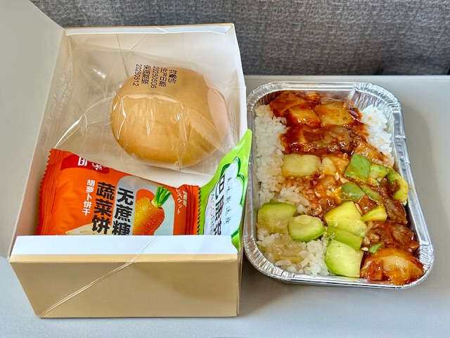

## China(Urumqi, Ili and Kumul), 13/May/2025-17/May/2025

**[<u>RAILWAYS IN GANSU, CHINA</u>](https://wqgcx.github.io/transport/20250513CN/CR/)**

**13/May/2025: Turpan, Urumqi**

**Fly China United Airlines to Turpan(KN5655)**

**Take Train K365 to Urumqi Railway Station**

**14/May/2025: Urumqi**

天山天池

**17/May/2025: Kumul, Turpan**

**Fly China United Airlines to Beijing(KN5656)**

**Click [here](https://wqgcx.github.io/travel/) to go back.**
