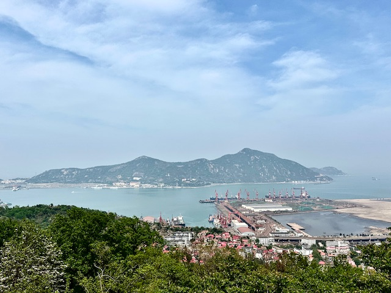
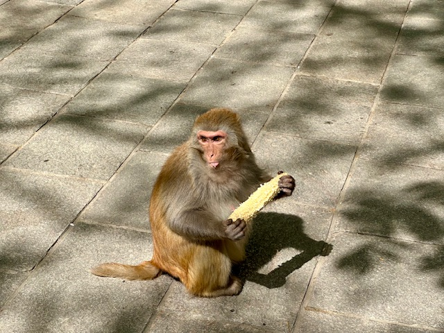
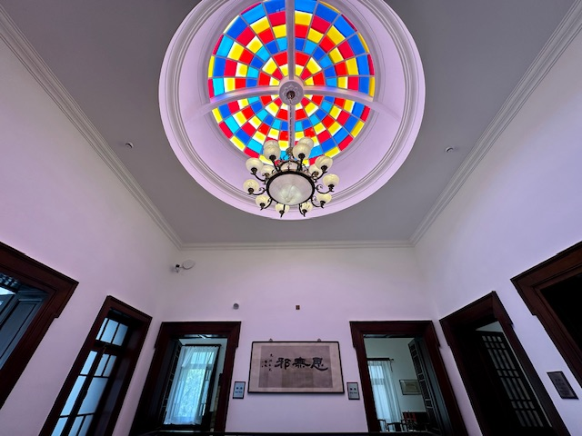

## China(Tianjin, Lianyungang and Suqian), 18/Apr/2025-22/Apr/2025

**[<u>RAILWAYS IN JIANGSU AND ANHUI, CHINA</u>](./CR)**

**18/Apr/2025: Tianjin(天津)**

瓷房子

**Fly China Eastern Airlines to Lianyungang(MU6742)**

**19/Apr/2025: Lianyungang(连云港)**

连岛

陇海铁路历史博物馆

连云古镇

海上云台山

海州古城

**20/Apr/2025: Lianyungang(连云港)**

桃花涧

孔望山

海清寺塔

花果山

**21/Apr/2025: Suqian(宿迁)**

洪泽湖湿地

**22/Apr/2025: Tianjin(天津)**

意式风情区

梁启超故居

西开教堂

静园(溥仪旧居)

**Click [here](..) to go back.**
