## China(Urumqi, Ili and Kumul), 13/May/2025-17/May/2025

**[<u>RAILWAYS IN XINJIANG, CHINA</u>](./CR)**

**13/May/2025: Turpan, Urumqi**

**Fly China United Airlines to Turpan(KN5655)**

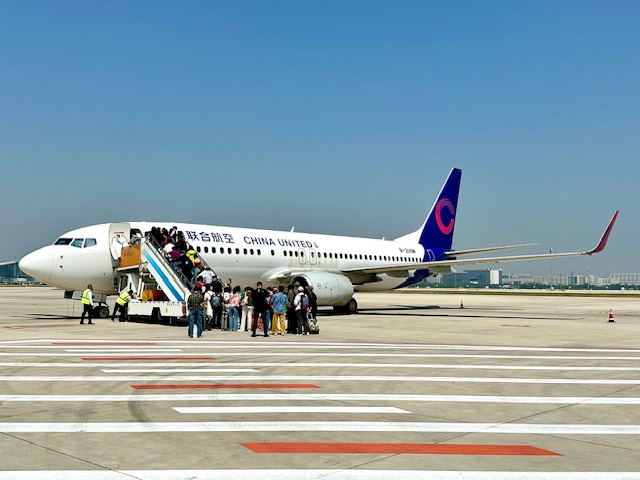
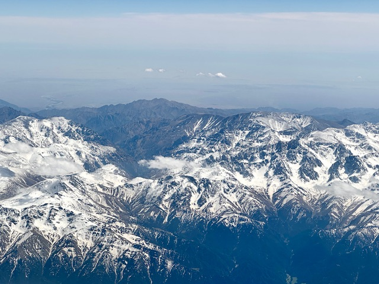

**Take Train K365 to Urumqi Railway Station**

**14/May/2025: Urumqi**

天山天池

**Take Train K6701 to Shihezi Railway Station**

**Take Train K9789 to Yining Railway Station**

**15/May/2025: Ili**

那拉提草原

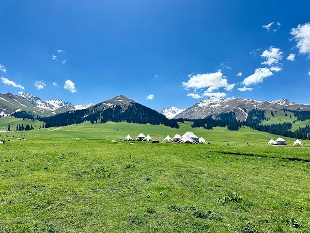

六星街

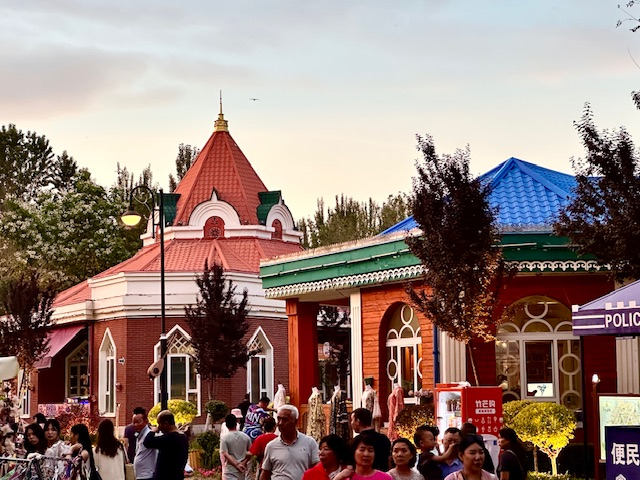

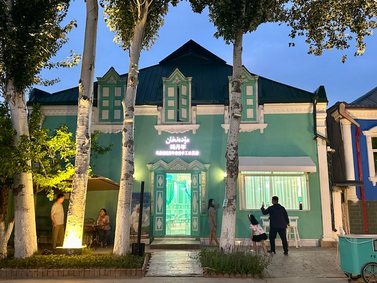
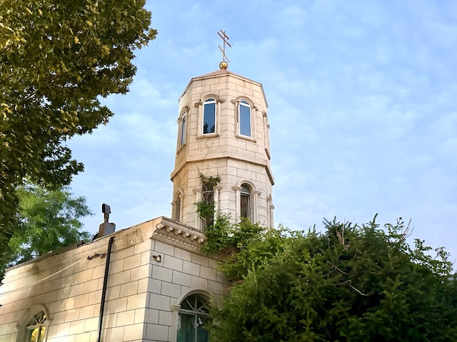

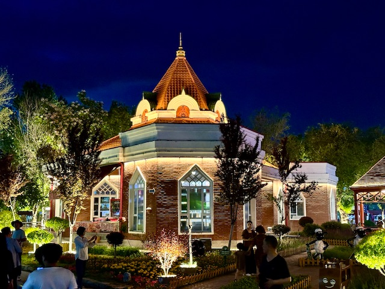

**15/May/2025: Ili, Kumul**

解放南路清真寺

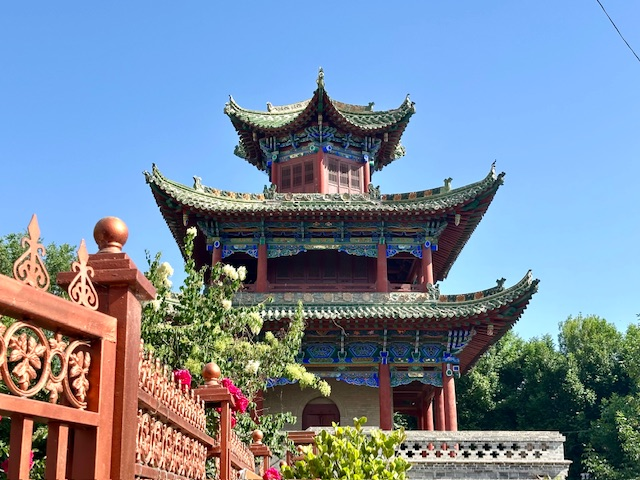

喀赞其街区

陕西大寺

**Fly China Express Airlines to Kumul(G54495)**

回王墓

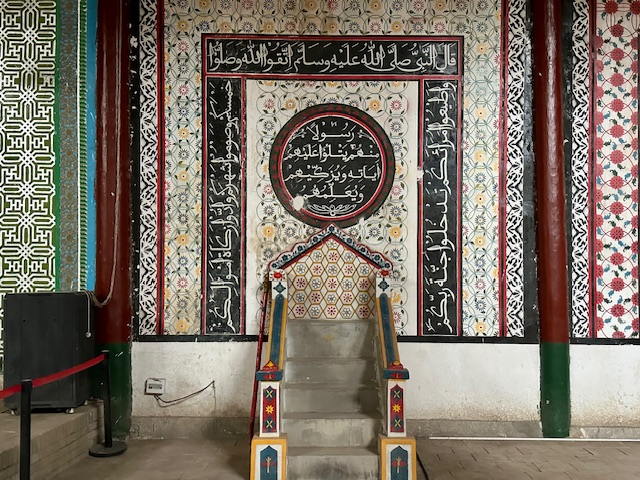

回王府

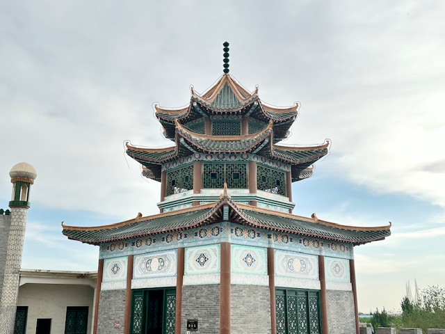
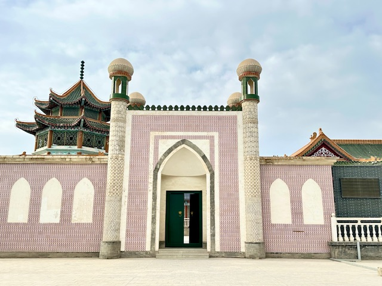

**17/May/2025: Kumul, Turpan**

**Take Train D8803 to Shanshanbei Railway Station**

**Take Train D8801 to Tulufanbei Railway Station**

**Fly China United Airlines to Beijing(KN5656)**

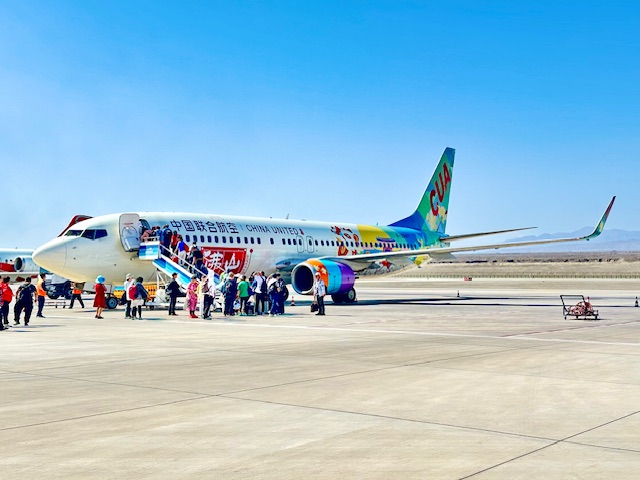

**Click [here](..) to go back.**
